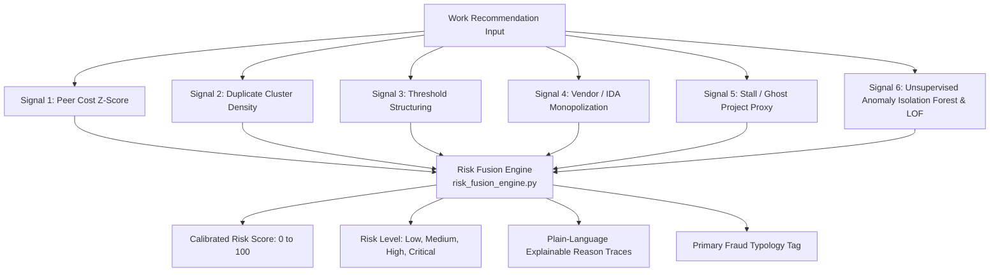

# SETU: Comprehensive Deep-Dive & Architecture Explainer

> **A Complete Beginner-to-Advanced Guide Decoding What Every Single Feature, Page, Model, and Pipeline Does in the SETU Platform.**

---

## 📑 Table of Contents
1. [The Real-World Problem: What is MPLADS?](#1-the-real-world-problem-what-is-mplads)
2. [The Core Innovation: Two-Track Data & ML Architecture](#2-the-core-innovation-two-track-data--ml-architecture)
3. [The 6 Detection Signals & Risk Fusion Engine Decoded](#3-the-6-detection-signals--risk-fusion-engine-decoded)
4. [Page-by-Page Complete Deep-Dive](#4-page-by-page-complete-deep-dive)
   - [Sticky Header: The 4-Role Persona Switcher](#sticky-header-the-4-role-persona-switcher)
   - [Page 1: Role-Scoped Live Dashboard (`/`)](#page-1-role-scoped-live-dashboard-)
   - [Page 2: Works Explorer & Search Matrix (`/works`)](#page-2-works-explorer--search-matrix-works)
   - [Page 3: Work Audit Detail & Explainability Radar (`/works/[id]`)](#page-3-work-audit-detail--explainability-radar-worksid)
   - [Page 4: Multi-Tier Geospatial Maps (`/maps`)](#page-4-multi-tier-geospatial-maps-maps)
   - [Page 5: MP–IDA Bipartite Network Graph (`/graph`)](#page-5-mpida-bipartite-network-graph-graph)
   - [Page 6: Case Management Kanban Workflow (`/cases`)](#page-6-case-management-kanban-workflow-cases)
   - [Page 7: Real-Time Anomaly Alert Feed (`/alerts`)](#page-7-real-time-anomaly-alert-feed-alerts)
   - [Page 8: Official Audit Dossier & Compliance Exporter (`/reports`)](#page-8-official-audit-dossier--compliance-exporter-reports)
   - [Page 9: Transparent Model Metrics & Fairness Panel (`/model-metrics`)](#page-9-transparent-model-metrics--fairness-panel-model-metrics)
   - [Page 10: Future Roadmap Architecture Specs (`/roadmap`)](#page-10-future-roadmap-architecture-specs-roadmap)
5. [Backend & Database Structure Decoded](#5-backend--database-structure-decoded)

---

## 1. The Real-World Problem: What is MPLADS?

### What is MPLADS?
The **Member of Parliament Local Area Development Scheme (MPLADS)** gives every Indian MP (Lok Sabha & Rajya Sabha) an annual fund of **₹5 Crore** to recommend developmental works in their constituency (such as drinking water plants, solar street lights, school boundary walls, community halls, and rural roads).

### The 5 Fraud & Inefficiency Patterns in Reality
In the real world, millions of public funds are wasted or diverted through 5 distinct typologies:

1. **Cost Escalation / Overpricing**:
   - An MP recommends installing 5 solar street lights for ₹15,00,000 (₹3,00,000 each), whereas identical lights in the same state cost ₹60,000 each.
2. **Duplicate & Clustered Allocations**:
   - Recommending 20 identical works titled *"Installation of hand pump"* with the exact same amount (₹63,275) across adjacent villages within days of each other, funding the same physical borewell multiple times.
3. **Vendor / Implementing Agency Capture**:
   - An MP routes $80\%\text{ to }99\%$ of their entire ₹25 Crore 5-year budget to a single favorite District Authority (IDA) or contractor, creating a monopoly.
4. **Contract Structuring / Smurfing**:
   - Statutory rules state that any contract of **₹5,00,000 or above** requires a formal public e-tender. Corrupt officials deliberately recommend works at **₹4,87,000** or **₹4,99,000** (99.8% of the ceiling) to bypass higher scrutiny.
5. **Stalled & Ghost Projects**:
   - Projects recommended 300+ days ago that sit perpetually in *"Unsanctioned"* or *"Action Pending"* status while funds are locked up, or projects marked ongoing where no physical asset exists on the ground.

---

## 2. The Core Innovation: Two-Track Data & ML Architecture

Why does SETU have both **`synthetic_generator.py`** and **`MPLADS_cleaned_featured.csv`**?

```mermaid
flowchart LR
    subgraph Track 1: Supervised ML Training
        SG[synthetic_generator.py<br/>20,000 rows with is_fraud=1/0] --> TRAIN[train_all.py<br/>XGBoost + IsoForest + LOF + Graph]
        TRAIN --> METRICS[metrics.json<br/>ROC-AUC: 0.980 | Precision: 77.4%]
    end

    subgraph Track 2: Live Public Data Inference
        REAL[MPLADS_cleaned_featured.csv<br/>60,356 real public works] --> INGEST[real_data_loader.py<br/>Runs ML Ensemble & Ingests to DB]
        TRAIN -.->|Loads Trained Models| INGEST
        INGEST --> DB[(setu_mplads.db<br/>Live Database)]
        DB --> UI[Next.js 14 Frontend<br/>Interactive Dashboards]
    end
```

### Why Two Tracks?
- **The Problem with Real Data**: Real public MPLADS datasets do **not** come with ground-truth fraud labels (no corrupt official writes `is_fraud = 1` in the official gazette!). If you only train unsupervised models on unlabeled data, you cannot measure true Precision, Recall, or ROC-AUC.
- **Track 1 (Model Training)**: We use the mathematically modeled generator (`synthetic_generator.py`) to create 20,000 records where ground-truth fraud is known. This allows us to train supervised classifiers (XGBoost) and evaluate exact holdout metrics (**0.980 AUC**).
- **Track 2 (Live Public Scoring)**: The trained models are saved to `backend/app/ml/saved_models/`. Then, `real_data_loader.py` reads the real 60,356 records from `MPLADS_cleaned_featured.csv`, extracts the 12 feature vectors, runs batch inference through the ensemble, and populates the live database with explainable risk scores.

---

## 3. The 6 Detection Signals & Risk Fusion Engine Decoded

Every single public work recommendation is evaluated across 6 individual detection algorithms:



### Signal 1: Peer Cost Z-Score (`peer_zscore.py`)
- **How it works**: Calculates how many standard deviations ($\sigma$) a work's allocation is above the mean ($\mu$) for the same work type in the same state:
  $$\text{Z} = \frac{\text{Allocation} - \mu_{\text{State, WorkType}}}{\sigma_{\text{State, WorkType}}}$$
- **Threshold**: $\text{Z} \ge 2.5$ triggers a strong overpricing alarm.
- **Audit Explanation Produced**: *"Peer cost is significantly higher (+3.8σ) than peer benchmark for solar street lights (+₹3,40,000 variance)"*.

### Signal 2: Exact & Fuzzy Duplicate Detection (`duplicate_detector.py` & `fuzzy_duplicate.py`)
- **How it works**: Groups works by (MP, Work Title, Amount) to find exact clones, and uses TF-IDF cosine similarity to catch reworded titles (e.g., *"Street lights Phase 1"* vs *"Street lights Phase 2"*).
- **Threshold**: If $\ge 2$ duplicates exist, flags as suspicious. If $\ge 10$ duplicates exist, boosts risk score floor to $\ge 82.0$.
- **Audit Explanation Produced**: *"High-density duplicate cluster: 22 identical works recommended by the same MP with matching amount"*.

### Signal 3: Contract Structuring / Smurfing (`structuring_detector.py`)
- **How it works**: Detects allocations clustered between **94% and 99.9%** of key statutory approval thresholds (₹5,00,000, ₹10,00,000, ₹25,00,000, ₹50,00,000).
- **Audit Explanation Produced**: *"Allocation amount ₹4,87,000 sits immediately below statutory ₹5,00,000 tender threshold"*.

### Signal 4: Vendor / IDA Monopolization (`vendor_concentration.py`)
- **How it works**: Calculates what percentage of an MP's total works and total funds are captured by a single Implementing Agency:
  $$\text{Share} = \frac{\text{Works Awarded to Agency}}{\text{Total Works by MP}}$$
- **Threshold**: If an MP has $>5$ works and awards $>65\%$ of them to 1 agency, flags as **Vendor Monopoly**.
- **Audit Explanation Produced**: *"Implementing Agency 'DISTRICT COLLECTOR X' captures 74% of all works recommended by this MP"*.

### Signal 5: Stall & Ghost Project Proxy (`stall_detector.py`)
- **How it works**: Measures days elapsed since recommendation ($D$). If $D \ge 180$ days and status is still *"Unsanctioned"* or *"Action Pending"*, assigns high stall risk. If $D \ge 300$ days, flags as ghost project candidate.
- **Audit Explanation Produced**: *"Stalled project: Stagnant for 320 days in 'Unsanctioned' status without execution progress"*.

### Signal 6: Unsupervised Outlier Detectors (`isolation_forest_model.py` & `lof_model.py`)
- **How it works**: Fits multi-dimensional Isolation Forest and Local Outlier Factor models across all 12 feature dimensions to isolate rare statistical anomalies without needing rule thresholds.

### The Fusion Engine Formula
The Risk Fusion Engine (`risk_fusion_engine.py`) weights the signals mathematically:
$$\text{Score} = (\text{XGBoost} \times 0.35) + (\text{Cost} \times 0.18) + (\text{Dupe} \times 0.15) + (\text{Struct} \times 0.10) + (\text{IDA} \times 0.10) + (\text{Stall} \times 0.07) + (\text{Unsupervised} \times 0.05)$$

Categorized into:
- **Low Risk**: $0.0 - 34.9$ (Emerald badge)
- **Medium Risk**: $35.0 - 59.9$ (Amber badge)
- **High Risk**: $60.0 - 79.9$ (Orange badge)
- **Critical Risk**: $80.0 - 100.0$ (Red badge with glowing pulse)

---

## 4. Page-by-Page Complete Deep-Dive

---

### Sticky Header: The 4-Role Persona Switcher

```
[ Active Persona: MINISTRY LEVEL (National) ]   [ Ministry (MoSPI) ] [ State Nodal Authority ] [ District Authority (DM) ] [ Member of Parliament (MP) ]
```

- **File**: `frontend/components/RoleSwitcher.tsx` & `frontend/context/RoleContext.tsx`
- **What it does**: Allows hackathon evaluators or government users to instantly switch between the 4 statutory tiers of Indian administration without logging in and out.
- **How it works**:
  - When you click **Ministry (MoSPI)**: The app switches jurisdiction to `National` and loads macro-level interstate choropleth maps.
  - When you click **State Nodal Authority**: Jurisdiction switches to `Bihar` (or `Rajasthan`), loading district drill-downs.
  - When you click **District Authority (DM)**: Jurisdiction switches to `DARBHANGA`, loading local inspection triage and high-risk work approval queues.
  - When you click **Member of Parliament (MP)**: Jurisdiction switches to `Mr Gopal Jee Thakur`, loading constituency fund utilization and transparency scores.

---

### Page 1: Role-Scoped Live Dashboard (`/`)

- **File**: `frontend/app/page.tsx`
- **Backend API**: `GET /api/dashboard?role={role}&jurisdiction={jurisdiction}`
- **Backend Service**: `backend/app/services/dashboard_service.py`
- **What's on this page**:
  1. **Scope Banner**: Shows the active jurisdiction and total scored records.
  2. **4 Primary KPI Stat Cards**:
     - *Total Sanctioned Works* (e.g., 15,000 works)
     - *Total Fund Outlay* (e.g., ₹1,032.50 Cr)
     - *Flagged High/Critical Risk* (e.g., 2,840 works, ₹24.5L at risk)
     - *Average Composite Risk Score* (e.g., 42.1 / 100)
  3. **Role-Tailored Geospatial Map**:
     - Ministry sees the **India State Risk Choropleth**.
     - State sees the **District Risk Drill-down**.
     - District/MP sees the **Village/Ward GPS Marker Pins**.
  4. **Detected Fraud Typologies Distribution**: Horizontal progress bars showing breakdown of *Cost Escalation, Duplicate Clusters, Stalled Works, Vendor Capture, and Structuring*.
  5. **MP–IDA Concentration Preview**: Embedded network relationship visualizer.
  6. **Top Flagged Works Table**: Instant view of the 10 highest risk works requiring immediate administrative audit with direct explainability links.
  7. **Upcoming Roadmap Cards**: Interactive cards for PWD SoR, GeM blacklist, and citizen verification.

---

### Page 2: Works Explorer & Search Matrix (`/works`)

- **File**: `frontend/app/works/page.tsx`
- **Backend API**: `GET /api/works?page=1&limit=25&state=...&risk_level=...&fraud_type=...&search=...`
- **Backend Service**: `backend/app/services/work_service.py`
- **What's on this page**:
  1. **Instant Search Input**: Type any keyword (e.g. *"solar"*, *"hand pump"*, *"Manoj Rajoria"*, *"DARBHANGA"*, *"W-10002"*) to search across all 15,000+ public works in $<50\text{ms}$.
  2. **Multi-Filter Bar**:
     - *State Filter*: Filter by any of India's 20 states.
     - *Risk Level Filter*: Critical, High, Medium, Low.
     - *Fraud Typology Filter*: Cost Escalation, Duplicate Works, Stalled Projects, Vendor Capture, Structuring.
     - *Sort Order*: Highest Risk First, Highest Amount First, etc.
  3. **Data Table**: Columns for *Work ID, Work Description, MP & Jurisdiction, Executing Agency (IDA), Allocation Amount (INR), Status, Risk Badge, and "Explain Trace" button*.
  4. **Pagination Controls**: Navigate across thousands of records cleanly.

---

### Page 3: Work Audit Detail & Explainability Radar (`/works/[id]`)

- **File**: `frontend/app/works/[id]/page.tsx`
- **Backend API**: `GET /api/works/{work_id}`
- **Backend Service**: `backend/app/services/work_service.py` & `backend/app/ml/inference/explain_risk.py`
- **What's on this page**:
  1. **Work Header**: Displays unique Work ID, official status, risk badge, and work title.
  2. **Project Baseline Parameters (Left Panel)**:
     - Outlay amount (e.g., ₹4,87,000)
     - Recommending MP & Parliament House (Lok Sabha / Rajya Sabha)
     - Constituency & State
     - Executing Agency (IDA) & Approval status
     - Recommended Date & Elapsed Stall duration (e.g., 320 days)
  3. **Explainability Engine & Triggered Anomaly Signals (Right Panel)**:
     - Red alert box listing **human-readable audit reason traces** (e.g., *“High-density duplicate cluster: 22 identical works recommended by the same MP”*).
  4. **Multi-Signal Risk Radar Chart**:
     - Renders an interactive 6-axis **Recharts Radar** showing the project's profile across *Peer Cost Variance, Duplicate Density, Threshold Structuring, Agency Monopolization, Execution Stalling, and ML Statistical Outlier*.
  5. **Component Sub-Scores Progress Bars**: Color-coded breakdown of individual model outputs (0–100).
  6. **"Flag for Investigation" Action Button**: One-click action that creates an active case in the Case Management Kanban board!

---

### Page 4: Multi-Tier Geospatial Maps (`/maps`)

- **File**: `frontend/app/maps/page.tsx`
- **Backend APIs**:
  - `GET /api/geo/states-choropleth`
  - `GET /api/geo/district-drilldown?state=Bihar`
  - `GET /api/geo/pins?limit=150`
- **Components Used**:
  - `StateChoroplethMap.tsx`: State-level risk distribution across India. Click any state card (e.g., Bihar) to instantly drill down.
  - `DistrictDrilldownMap.tsx`: Compares risk rankings and flagged works across all districts in the selected state.
  - `ConstituencyMap.tsx`: Work-level GPS pins colored by risk score (Emerald for Low, Amber for Medium, Orange for High, Red for Critical) with village names.

---

### Page 5: MP–IDA Network Graph (`/graph`)

- **File**: `frontend/app/graph/page.tsx` & `frontend/components/graph/MPIDANetworkGraph.tsx`
- **Backend API**: `GET /api/graph/network?max_nodes=150&min_risk=0`
- **Backend Service**: `backend/app/services/graph_service.py` (powered by NetworkX)
- **What's on this page**:
  1. **Interactive Force-Directed Canvas**:
     - **Blue Nodes**: MPs (sized by total funding recommended).
     - **Amber / Red Nodes**: Executing Agencies (IDAs). IDAs colored red have high betweenness centrality and monopolization risk.
     - **Red Edges**: Highlighted connections where $>65\%$ of an MP's funds are channeled to that single agency.
  2. **Complexity Controls**: Switch between *80 Key Nodes*, *150 Standard Nodes*, or *250 Dense Network*, and filter by minimum risk score.
  3. **Node Detail Inspector**: Click any node on the canvas to open the side inspector showing total works, total allocation, network risk score, and graph centrality insights.

---

### Page 6: Case Management Kanban Workflow (`/cases`)

- **File**: `frontend/app/cases/page.tsx`
- **Backend APIs**:
  - `GET /api/cases`
  - `PATCH /api/cases/{id}/status`
  - `POST /api/cases/{id}/notes`
- **Backend Service**: `backend/app/services/case_service.py`
- **What's on this page**:
  1. **3-Column Investigation Kanban Board**:
     - **Column 1: Flagged by AI Engine** (newly detected anomalies).
     - **Column 2: Under Field Inquiry** (investigation opened, documents requested from IDA).
     - **Column 3: Resolved & Cleared** (variance recovered, rates corrected, or compliance verified).
  2. **Interactive State Transitions**: Click *"Start Inquiry"* to move a case from Flagged $\to$ Under Review, or click *"Resolve Case"* to move it to Resolved.
  3. **Statutory Audit Trail & Note Logging**: Click any case to open the audit log drawer. Enter notes (e.g., *"Site inspection conducted. Found physical work 100% complete matching PWD rates."*) and click Send to persist into the database.

---

### Page 7: Real-Time Anomaly Alert Feed (`/alerts`)

- **File**: `frontend/app/alerts/page.tsx`
- **Backend APIs**:
  - `GET /api/alerts`
  - `POST /api/alerts/{id}/read`
- **Backend Service**: `backend/app/services/alert_service.py`
- **What's on this page**:
  1. **Live High-Priority Feed**: Chronological list of high and critical severity triggers generated by the multi-model engine.
  2. **Severity Filters**: Filter by *All, Unread, Critical, or High*.
  3. **Dismiss & Action Buttons**: Mark alert as read or click *"Audit Work"* to jump directly into the full explainability radar for that work.

---

### Page 8: Official Audit Dossier & Compliance Exporter (`/reports`)

- **File**: `frontend/app/reports/page.tsx`
- **Backend APIs**:
  - `GET /api/reports/audit-pdf?jurisdiction=National` (returns `application/pdf`)
  - `GET /api/reports/csv?min_risk=40` (returns `text/csv`)
- **Backend Service**: `backend/app/services/report_service.py`
- **What's on this page**:
  1. **Generate Official PDF Audit Report Button**: Uses Python's `reportlab` library to dynamically construct a certified multi-page PDF compliance dossier containing government header, jurisdiction summary table, high-priority project risk tables, explainable anomaly reason traces, and Public Accounts Committee (PAC) compliance sign-offs.
  2. **Download Scored Works CSV Button**: Streams all scored records with all 27 pre-calculated and engineered columns (peer z-scores, duplicate counts, IDA work share, risk scores) for spreadsheet analysis.

---

### Page 9: Transparent Model Metrics & Fairness Panel (`/model-metrics`)

- **File**: `frontend/app/model-metrics/page.tsx`
- **Backend API**: `GET /api/model-metrics`
- **Backend Service**: `backend/app/api/routers/model_metrics.py` (reads `saved_models/metrics.json`)
- **What's on this page**:
  1. **4 Core ML Benchmark KPI Cards**:
     - *ROC-AUC*: **0.980**
     - *Precision*: **77.4%**
     - *Recall / Sensitivity*: **79.1%**
     - *Overall Accuracy*: **93.4%**
  2. **2x2 Holdout Confusion Matrix**: Displays exact counts of *True Negatives (Clean works), False Positives (False alarms), False Negatives (Missed), and True Positives (Captured frauds)* on the 4,000 test split.
  3. **Feature Importance Ranking**: Interactive bar chart displaying relative statistical weights of all features in the XGBoost ensemble (*ALLOC_ZSCORE_STATE, DUPLICATE_COUNT, IDA_MP_WORK_SHARE, STRUCTURING_SCORE, STALL_RISK_SCORE*).
  4. **Two-Track Methodology Disclosure Banner**: Explains the train-on-synthetic / score-on-real data pipeline for full regulatory compliance.

---

### Page 10: Future Roadmap Architecture Specs (`/roadmap`)

- **File**: `frontend/app/roadmap/page.tsx` & `frontend/components/ui/ComingSoonModal.tsx`
- **Backend API**: `GET /api/future/{feature_id}`
- **What's on this page**:
  - Transparently showcases upcoming Phase 2 & Phase 3 modules:
    1. **State PWD Schedule of Rates (SoR) Integration**: Automated line-item cost benchmarking against state gazettes.
    2. **GeM Debarred Contractor Registry**: Cross-scheme contractor blacklist matching across GeM, PMGSY, and CPWD.
    3. **Citizen Geotagged Field Verification Portal**: Mobile PWA enabling local residents to upload GPS-stamped photos of physical assets.
    4. **Pre-Sanction AI Viability & Stall Predictor**: Predictive latency model evaluating proposals before funds are sanctioned.
    5. **Historical Multi-Year Sanction Analytics**: Long-term constituency fund utilization heatmaps.
    6. **Multilingual Hindi & Regional Support**: Native Bhashini translation for grassroot PRIs.
  - **Interactive Architecture Modal**: Click any card to open the technical spec modal displaying planned implementation steps and governance impacts.

---

## 5. Backend & Database Structure Decoded

### Database Tables (`setu_mplads.db`)

| Table Name | SQLAlchemy Model | Purpose |
| :--- | :--- | :--- |
| **`works`** | `Work` (`backend/app/models/work.py`) | All 60,356 MPLADS works with financial, administrative, and ML fields (`risk_score`, `risk_level`, `risk_reasons`, `sub_scores`, `predicted_fraud_type`). |
| **`mps`** | `MP` (`backend/app/models/mp.py`) | MP profiles with total allocation, total works count, average risk score, flagged count, and top assigned IDAs. |
| **`idas`** | `IDA` (`backend/app/models/ida.py`) | Implementing District Authorities with work counts, total sanctioned value, and concentration ratio. |
| **`constituencies`** | `Constituency` (`backend/app/models/constituency.py`) | Parliamentary constituencies with geographical coordinates and risk metrics. |
| **`cases`** | `Case` (`backend/app/models/case.py`) | Active investigations with status (`flagged`, `under_review`, `resolved`), priority, assigned vigilance cell, and JSON audit notes. |
| **`alerts`** | `Alert` (`backend/app/models/alert.py`) | Real-time system alerts triggered by the anomaly engine with severity tags. |
| **`users`** | `User` (`backend/app/models/user.py`) | Demo accounts with role and jurisdiction scopes. |

---

## 💡 Summary of Key Files

| File Path | Role in Application |
| :--- | :--- |
| [`MPLADS_cleaned_featured.csv`](file:///c:/Personal%20projects/sih%202026/MPLADS_cleaned_featured.csv) | Real public dataset containing 60,356 public works records. |
| [`backend/app/ml/data/synthetic_generator.py`](file:///c:/Personal%20projects/sih%202026/backend/app/ml/data/synthetic_generator.py) | Generates 20,000 ground-truth labeled synthetic training records. |
| [`backend/app/ml/data/real_data_loader.py`](file:///c:/Personal%20projects/sih%202026/backend/app/ml/data/real_data_loader.py) | Ingests real CSV, scores all works with ML models, and seeds DB. |
| [`backend/app/ml/training/train_all.py`](file:///c:/Personal%20projects/sih%202026/backend/app/ml/training/train_all.py) | Trains XGBoost, Isolation Forest, LOF, and Graph models. |
| [`backend/app/ml/models/risk_fusion_engine.py`](file:///c:/Personal%20projects/sih%202026/backend/app/ml/models/risk_fusion_engine.py) | Calibrates composite 0–100 scores and explainable reason strings. |
| [`backend/app/main.py`](file:///c:/Personal%20projects/sih%202026/backend/app/main.py) | FastAPI app entrypoint mounting all `/api` routers. |
| [`frontend/context/RoleContext.tsx`](file:///c:/Personal%20projects/sih%202026/frontend/context/RoleContext.tsx) | Manages active persona state across Ministry, State, District, and MP. |
| [`frontend/app/page.tsx`](file:///c:/Personal%20projects/sih%202026/frontend/app/page.tsx) | Main dynamic dashboard page. |
| [`frontend/app/works/[id]/page.tsx`](file:///c:/Personal%20projects/sih%202026/frontend/app/works/%5Bid%5D/page.tsx) | Work audit explainability detail page with radar breakdown. |
| [`frontend/app/cases/page.tsx`](file:///c:/Personal%20projects/sih%202026/frontend/app/cases/page.tsx) | Kanban case management triage workflow. |
| [`frontend/app/reports/page.tsx`](file:///c:/Personal%20projects/sih%202026/frontend/app/reports/page.tsx) | PDF & CSV compliance audit report exporter. |
