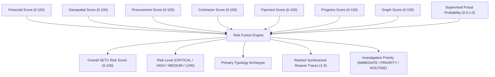

# SETU — Backend Pending Work & Model Implementation Handover Guide

> **Repository**: `Barath-j593/sih-2026`  
> **Workspace**: `backend/app/ml/`  
> **Target Audience**: Backend & ML Engineers implementing remaining SETU detection components  
> **Companion Document**: [`README.md`](./README.md) (Complete Architecture & Foundations Reference)  

---

## 1. Executive Summary & Purpose of This Document

This document serves as the **actionable developer backlog and technical specification** for completing the remaining backend ML detection models, the supervised risk predictor, and the final risk-fusion integration for the **SETU MPLADS Anomaly Detection platform**.

If you are a teammate picking up backend development, this guide tells you:
1. **What is already built and working** (so you do NOT rebuild it).
2. **The exact sequence of models to implement** (Stages 2C through 4).
3. **The exact features, algorithms, formulas, and schemas** for every pending model.
4. **The standardized file blueprint** that every new model package must follow.
5. **How to test, evaluate, and serialize** your model before merging.

---

## 2. Current Implementation Baseline (What is DONE)

Before writing any new code, verify the completed foundations inside `backend/`:

```
┌──────────────────────────────────────────────────────────────────────────────────┐
│                             COMPLETED BASELINE STATUS                            │
├──────────────────────────────────────────────────────────────────────────────────┤
│  Stage 1: Relational Data Foundation (12 CSVs -> Master Features)   ─── [DONE]   │
│  Stage 2A: 239-Column Feature Audit & Safety Classification        ─── [DONE]   │
│  Stage 2B: Financial Anomaly Model (Isolation Forest + Peer MAD)    ─── [DONE]   │
│  Automated ML Test Suite (31 / 31 Pytest Tests Passing)             ─── [DONE]   │
└──────────────────────────────────────────────────────────────────────────────────┘
```

### Key Canonical Files Already in Place:
* **Master Feature Store**: `backend/app/ml/data/processed/project_master_features.csv` (5,000 rows $\times$ 239 columns, exactly 1 row per project).
* **Quarantined Labels**: `backend/app/ml/data/processed/project_labels.csv` (5,000 rows $\times$ 10 columns — **STRICTLY QUARANTINED**; use ONLY post-scoring for evaluation metrics).
* **Feature Registry**: `backend/app/ml/data/reports/FEATURE_REGISTRY.md` (authoritative safety and classification dictionary for all 239 features).
* **Financial Model Reference**: `backend/app/ml/models/financial/` (use this as the architectural reference template for all future models).

---

## 3. Pending Backend Work Roadmap (Execution Queue)

The remaining work is divided into sequential, modular stages:

| Stage | Subsystem / Model Name | Target Subdirectory | Primary Algorithm | Priority |
| :---: | :--- | :--- | :--- | :---: |
| **Stage 2C** | **Geospatial / Spatial Clustering Model** | `models/geospatial/` | Spatial DBSCAN / Spatial LOF / Haversine Distance | **HIGH (Next Task)** |
| **Stage 2D** | **Procurement & Tender Rigging Model** | `models/procurement/` | Benford Testing + Bidding Isolation Forest | **HIGH** |
| **Stage 2E** | **Contractor & Agency Monopolization Model** | `models/contractor/` | Entity Monopolization Index + Backlog Strain | **MEDIUM** |
| **Stage 2F** | **Granular Payment Structuring Model** | `models/payment/` | Threshold Smurfing + Disbursement Entropy | **MEDIUM** |
| **Stage 2G** | **Progress vs. Execution Trajectory Model**| `models/progress/` | Financial-Physical Divergence + Stall Proxy | **MEDIUM** |
| **Stage 2H** | **Graph & Entity Relationship Model** | `models/graph/` | NetworkX Centrality + Louvain Community Mining | **HIGH** |
| **Stage 3** | **Supervised Calibrated Risk Predictor** | `models/supervised/` | Calibrated XGBoost / LightGBM Ensemble | **HIGH** |
| **Stage 4** | **Multi-Signal Risk Fusion Integration** | `models/risk_fusion_engine.py` | Multi-Evidence Fusion & Reason Synthesizer | **HIGH** |
| **Stage 5** | **FastAPI Endpoint & DB Serving Integration** | `api/routers/` | Batch Inference & Case Generation Routes | **FINAL** |

---

## 4. Stage 2C — Geospatial / Spatial Anomaly Model

### Objective
Detect spatial anomalies, including:
* Artificial geographic clustering of recommendations in specific pockets.
* Spatial cost discrepancies (e.g., identical road work costing 3x more than neighboring village works).
* Implausible project density relative to local population density or infrastructure gap index.
* High travel/logistical strain across simultaneous projects executed by a single contractor.

### Target Subdirectory
```text
backend/app/ml/models/geospatial/
```

### Approved Features to Select from `project_master_features.csv`
* `project__project_latitude`, `project__project_longitude`
* `geo__district_latitude`, `geo__district_longitude`
* `geo__population_density`, `geo__infrastructure_gap_index`, `geo__poverty_rate`, `geo__literacy_rate`
* `geo__geographic_cluster_id`
* `financial__sanctioned_amount`, `financial__estimated_cost`
* `project__work_type`, `project__category`

### Recommended Algorithm & Preprocessing
1. **Haversine Distance Matrix**: Compute spatial proximity between active works.
2. **Spatial DBSCAN / HDBSCAN**: Identify dense recommendation clusters ($\epsilon \approx 5\text{km}$, $\text{min\_samples} = 3$).
3. **Spatial Cost Peer Normalization**:
   $$\text{Spatial } Z = \frac{\text{Project Unit Cost} - \text{Median}(\text{Cluster Unit Costs})}{1.4826 \times \text{MAD}(\text{Cluster Unit Costs}) + \epsilon}$$
4. **Spatial LOF (Local Outlier Factor)**: Detect isolated works with disproportionate funding relative to neighboring density.

### Output Schema (`geospatial_anomaly_scores.csv`)
* `project_id`: string
* `geospatial_anomaly_score`: float (`0.0 - 100.0`)
* `geospatial_anomaly_percentile`: float (`0.0 - 100.0`)
* `is_geospatial_anomaly`: boolean (top 5% flag)
* `spatial_cluster_id`: integer / string
* `primary_reason`, `secondary_reason`, `tertiary_reason`: strings

### Hard-Negative Handling
* **`LEGITIMATE_REMOTE_SINGLE_BID`**: Remote, high-altitude, or island projects must not be penalized solely for being geographically isolated. Normalize against terrain/state clusters.

---

## 5. Stage 2D — Procurement & Tender Rigging Anomaly Model

### Objective
Detect suspicious procurement, tender rigging, and non-competitive contracting:
* Single-bid dominance in categories where multiple bidders are standard.
* Narrow winning bid margins (e.g., winning by $< 0.5\%$ against token shadow bidders).
* Artificial compression of tender submission windows (e.g., tender open for $< 3$ days).
* High re-tender or cancellation rates indicating tailored tender specifications.

### Target Subdirectory
```text
backend/app/ml/models/procurement/
```

### Approved Features to Select from `project_master_features.csv`
* `procurement__bidding_type`, `procurement__bidder_count`, `procurement__single_bid_flag`
* `procurement__tender_duration_days`, `procurement__bid_variance`, `procurement__winning_bid_margin`
* `procurement__tender_estimated_cost`, `procurement__tender_quoted_amount`, `procurement__tender_cost_ratio`
* `procurement__tender_rejection_count`, `procurement__re_tender_count`, `procurement__procurement_method_deviation`
* `contract__contract_award_value`, `contract__contract_variation_amount`

### Recommended Algorithm & Preprocessing
1. **Single-Bid Risk Scoring**: Peer-adjusted single-bid frequency normalized by `work_type` and `district_id`.
2. **Tender Window Anomaly**: Log-scaled tender duration Z-score relative to statutory procurement rules ($< 7$ days $\rightarrow$ high penalty).
3. **Isolation Forest on Bidding Vectors**: Multivariate scoring across bidder count, bid margin, and tender-to-estimate ratio.

### Output Schema (`procurement_anomaly_scores.csv`)
* `project_id`: string
* `procurement_anomaly_score`: float (`0.0 - 100.0`)
* `procurement_anomaly_percentile`: float (`0.0 - 100.0`)
* `is_procurement_anomaly`: boolean (top 5% flag)
* `primary_reason`, `secondary_reason`, `tertiary_reason`: strings

---

## 6. Stage 2E — Contractor & Implementing Agency Monopolization Model

### Objective
Detect vendor capture, agency monopolization, capacity strain, and corporate collusion:
* MP channeling $> 65\%$ of developmental funds to a single Implementing District Agency (IDA).
* Contractor backlog exceeding registered financial capacity (value-to-capacity ratio $> 1.5$).
* Competing contractors sharing corporate directors, registered office addresses, or beneficial owners.
* Sudden contractor ownership changes immediately preceding major tender awards.

### Target Subdirectory
```text
backend/app/ml/models/contractor/
```

### Approved Features to Select from `project_master_features.csv`
* `contractor__contractor_financial_capacity`, `contractor__contractor_value_to_capacity`
* `contractor__contractor_workload_ratio`, `contractor__active_project_count`
* `contractor__contractor_past_delay_rate`, `contractor__contractor_blacklisted_flag`
* `contractor__repeated_agency_contractor_pair`, `contractor__shared_ownership`
* `contractor__shared_directors`, `contractor__shared_shareholders`, `contractor__shared_address`, `contractor__beneficial_owner_overlap`
* `contractor__company_ownership_change`, `contractor__director_change`
* `agency__agency_workload_ratio`, `agency__agency_geographic_concentration`

### Recommended Algorithm & Preprocessing
1. **Entity Capacity Strain Index**:
   $$\text{Strain} = \max\left(0, \frac{\text{Active Backlog Value}}{\text{Financial Capacity}} - 1.0\right)$$
2. **Corporate Collusion Binary Mask**: Weighted composite score of shared addresses, directors, and ownership flags.
3. **Monopolization Ratio**: Herfindahl-Hirschman Index (HHI) of contractor and agency funding shares per constituency.

### Output Schema (`contractor_agency_anomaly_scores.csv`)
* `project_id`: string
* `contractor_agency_anomaly_score`: float (`0.0 - 100.0`)
* `contractor_agency_percentile`: float (`0.0 - 100.0`)
* `is_contractor_anomaly`: boolean (top 5% flag)
* `primary_reason`, `secondary_reason`, `tertiary_reason`: strings

---

## 7. Stage 2F — Granular Payment Structuring Model

### Objective
Detect transaction-level smurfing, disbursement velocity bursts, and unverified releases:
* Contract disbursements structured immediately below statutory approval thresholds (e.g., ₹14.99L vs. ₹15.00L tender ceiling).
* Same-day payment bursts (multiple installments released on the same calendar date).
* Abnormally high round-number payments (e.g., 90% of installments ending in exact ₹00,000).
* Disproportionate unverified installment releases without engineering inspection sign-offs.

### Target Subdirectory
```text
backend/app/ml/models/payment/
```

### Approved Features to Select from `project_master_features.csv`
* `payment__pay_count`, `payment__pay_total_amount`, `payment__pay_amount_velocity_per_day`
* `payment__pay_inter_payment_mean_days`, `payment__pay_inter_payment_std_days`
* `payment__pay_max_share_of_total`, `payment__pay_entropy`
* `payment__pay_same_day_payment_count`, `payment__pay_round_amount_fraction`
* `payment__pay_unverified_count`, `payment__pay_unverified_ratio`
* `payment__pay_final_installment_ratio`

### Recommended Algorithm & Preprocessing
1. **Statutory Ceiling Smurfing Detector**:
   $$\text{Smurf Score} = \exp\left(-\frac{(\text{Sanction Amount} - \text{Threshold})^2}{2 \sigma^2}\right) \quad \text{for amounts in } [\text{Threshold} - 5\%, \text{Threshold}]$$
2. **Entropy Anomaly**: Lower Shannon entropy indicates unnatural disbursement clustering into single massive tranches.
3. **Multi-Attribute Isolation Forest**: Trained on payment velocity, round fractions, and unverified ratios.

### Output Schema (`payment_anomaly_scores.csv`)
* `project_id`: string
* `payment_anomaly_score`: float (`0.0 - 100.0`)
* `payment_anomaly_percentile`: float (`0.0 - 100.0`)
* `is_payment_anomaly`: boolean (top 5% flag)
* `primary_reason`, `secondary_reason`, `tertiary_reason`: strings

---

## 8. Stage 2G — Progress vs. Execution Trajectory Model

### Objective
Detect ghost works, abandoned projects, and physical-financial execution divergence:
* Financial expenditure leading physical completion by $> 30\%$ (`prog_financial_physical_gap`).
* Execution stall (project active $> 180$ days with 0% progress reporting).
* Missing Measurement Book (MB) verification across major expenditure tranches.
* Missing or contradictory geotagged photo evidence.

### Target Subdirectory
```text
backend/app/ml/models/progress/
```

### Approved Features to Select from `project_master_features.csv`
* `progress__prog_latest_physical_progress`, `progress__prog_latest_financial_progress`, `progress__prog_latest_planned_progress`
* `progress__prog_financial_physical_gap`, `progress__prog_actual_vs_planned_gap`
* `progress__prog_physical_slope_per_day`, `progress__prog_financial_slope_per_day`, `progress__prog_expenditure_acceleration`
* `progress__prog_delay_count`, `progress__prog_reported_delay_days`, `progress__prog_extension_count`, `progress__prog_extension_days`
* `progress__prog_geotag_available_fraction`, `progress__prog_geotag_mismatch_count`, `progress__prog_mb_verified_fraction`

### Recommended Algorithm & Preprocessing
1. **Divergence Penalty**: Linear + exponential penalty for positive financial-physical gap:
   $$\text{Gap Penalty} = \max\left(0, \frac{\text{Financial \%} - \text{Physical \%}}{100}\right)^2$$
2. **Stall Proxy**: Sigmoid function of elapsed days since last progress observation relative to planned duration.
3. **Verification Deficit Score**: Inverse weighting on Measurement Book and geotag availability.

### Output Schema (`progress_anomaly_scores.csv`)
* `project_id`: string
* `progress_anomaly_score`: float (`0.0 - 100.0`)
* `progress_anomaly_percentile`: float (`0.0 - 100.0`)
* `is_progress_anomaly`: boolean (top 5% flag)
* `primary_reason`, `secondary_reason`, `tertiary_reason`: strings

---

## 9. Stage 2H — Graph & Entity Relationship Model

### Objective
Model the entire MPLADS ecosystem as a heterogeneous graph to detect collusive cliques, circular bidding, and entity centrality spikes.

### Target Subdirectory
```text
backend/app/ml/models/graph/
```

### Graph Construction Architecture
Construct a bipartite / heterogeneous graph in **NetworkX**:
* **Nodes**:
  * `MP` (Member of Parliament)
  * `Constituency`
  * `Project`
  * `Agency` (Implementing District Agency)
  * `Contractor`
  * `District`
* **Edges**:
  * `(MP) -[RECOMMENDED]-> (Project)`
  * `(Constituency) -[LOCATED_IN]-> (Project)`
  * `(Project) -[IMPLEMENTED_BY]-> (Agency)`
  * `(Project) -[AWARDED_TO]-> (Contractor)`
  * `(Contractor) -[SHARED_TIES]-> (Contractor)` (using shared director/address flags)

### Candidate Graph Metrics & Algorithms
1. **Degree Centrality & Betweenness Centrality**: Detect hub contractors monopolizing multiple MP allocations.
2. **PageRank Anomaly**: High PageRank for newly registered contractors with no physical track record.
3. **Louvain Community Detection**: Detect dense, closed tripartite subgraphs (`MP <-> Agency <-> Contractor`) that systematically exclude external vendors.
4. **Bipartite Density Score**: Edge density within localized constituency bipartite projections.

### Output Schema (`graph_anomaly_scores.csv`)
* `project_id`: string
* `graph_anomaly_score`: float (`0.0 - 100.0`)
* `graph_anomaly_percentile`: float (`0.0 - 100.0`)
* `is_graph_anomaly`: boolean (top 5% flag)
* `clique_community_id`: string / integer
* `primary_reason`, `secondary_reason`, `tertiary_reason`: strings

---

## 10. Stage 3 — Supervised Calibrated Risk Predictor

> **CRITICAL ARCHITECTURAL RULE**:  
> **Stage 3 must NOT be implemented until Models 1 through 7 (Stages 2B–2H) have been built, evaluated, and verified.**

### Objective
Train a supervised gradient-boosted ensemble classifier that consumes the **orthogonal anomaly scores from Models 1–7** alongside project context to predict the calibrated probability of true fraud typologies.

### Target Subdirectory
```text
backend/app/ml/models/supervised/
```

### Input Matrix Composition
1. **Intermediate Evidence Scores (7 Columns)**:
   * `financial_anomaly_score`
   * `geospatial_anomaly_score`
   * `procurement_anomaly_score`
   * `contractor_agency_anomaly_score`
   * `payment_anomaly_score`
   * `progress_anomaly_score`
   * `graph_anomaly_score`
2. **Non-Leaking Project Context (5–10 Columns)**:
   * `project__planned_duration_days`, `project__project_size`
   * `geo__population_density`, `geo__infrastructure_gap_index`
   * `financial__sanctioned_amount`
3. **Ground Truth Target (from `project_labels.csv`)**:
   * `is_fraud` (binary classification target)
   * `scenario_type` (for multi-class typology evaluation)

### Model Architecture & Training Protocol
* **Algorithm**: **XGBoost** (`XGBClassifier`) or **LightGBM** (`LGBMClassifier`).
* **Validation Strategy**: Stratified 5-Fold Cross-Validation (`StratifiedKFold(n_splits=5, shuffle=True, random_state=42)`).
* **Imbalance Handling**: Set `scale_pos_weight = (num_negative / num_positive)`.
* **Probability Calibration**: Wrap with `CalibratedClassifierCV(method='isotonic', cv='prefit')` to ensure predicted probabilities match empirical risk rates.
* **Evaluation Standards**:
  * PR-AUC (Precision-Recall Area Under Curve) $\ge 0.85$
  * ROC-AUC $\ge 0.95$
  * Top 1% Enrichment $\ge 4.0\text{x}$
  * Hard Negative False Positive Rate (`is_hard_negative == 1`) $\le 5.0\%$

### Output Schema (`supervised_fraud_scores.csv`)
* `project_id`: string
* `fraud_probability`: float (`0.0000 - 1.0000`)
* `predicted_typology`: string (e.g., `COST_OVERRUN`, `VENDOR_CAPTURE`, `GHOST_PROJECT`, `BID_RIGGING`)
* `feature_importance_contributions`: JSON dict of SHAP / tree contributions

---

## 11. Stage 4 — Multi-Signal Risk Fusion Integration

### Objective
Update `backend/app/ml/models/risk_fusion_engine.py` to synthesize intermediate evidence signals (Models 1–7) and the supervised probability (Model 8) into final actionable audit intelligence.



### Risk Tier Thresholds
* **`CRITICAL`** ($\text{Risk Score} \ge 80.0$ OR $\text{Fraud Probability} \ge 0.85$): Requires immediate administrative freeze / physical audit.
* **`HIGH`** ($60.0 \le \text{Risk Score} < 80.0$): Prioritized for District Magistrate desk inspection.
* **`MEDIUM`** ($40.0 \le \text{Risk Score} < 60.0$): Routine monitoring with flagged documentation requirements.
* **`LOW`** ($\text{Risk Score} < 40.0$): Benign project progressing within normal parameters.

---

## 12. Standard File Structure Blueprint for Every Model Package

Every model in `backend/app/ml/models/<domain>/` must adhere to this uniform 7-file package architecture:

```
backend/app/ml/models/<domain>/
├── __init__.py               # Clean subpackage exports
├── config.py                 # Dataclass holding hyperparameters, random_state, and feature lists
├── preprocessor.py           # Feature selector, imputation, peer Median/MAD transforms, scaler
├── baseline_detectors.py     # Simple rule/univariate benchmark detector for comparative evaluation
├── <domain>_model.py         # Core ML model class (fit, predict_score, explain_reasons)
├── evaluator.py              # Score distribution, fraud enrichment, hard-negative evaluator
├── pipeline.py               # End-to-end CLI runner (trains, scores, serializes artifacts, exports report)
│
└── artifacts/                # Serialized outputs
    ├── <domain>_model.joblib
    ├── <domain>_preprocessor.joblib
    ├── <domain>_features.json
    ├── <domain>_model_config.json
    ├── <domain>_model_metadata.json
    └── training_summary.json
```

---

## 13. Developer Step-by-Step Execution Checklist

When starting work on your assigned model stage, follow this checklist sequentially:

```markdown
- [ ] 1. Read README.md and this BACKEND_PENDING_WORK.md thoroughly.
- [ ] 2. Ensure your virtual environment is active (.\backend\venv\Scripts\Activate.ps1).
- [ ] 3. Confirm all 31 existing tests pass: pytest backend/tests/ml/ -v.
- [ ] 4. Check backend/app/ml/data/reports/FEATURE_REGISTRY.md for your domain features.
- [ ] 5. Create package directory: backend/app/ml/models/<domain>/.
- [ ] 6. Implement config.py (pinned random_state = 42, mode = "early_warning").
- [ ] 7. Implement preprocessor.py with robust scaling and peer normalization.
- [ ] 8. Implement baseline_detectors.py for benchmark comparison.
- [ ] 9. Implement the core model (<domain>_model.py) with 0-100 score calibration.
- [ ] 10. Implement explainable reason trace generator (primary, secondary, tertiary).
- [ ] 11. Implement evaluator.py computing Top 1%, 5%, 10% fraud enrichment factors.
- [ ] 12. Implement pipeline.py orchestrating training, scoring 5,000 projects, and saving artifacts.
- [ ] 13. Write comprehensive unit & integration tests under backend/tests/ml/models/test_<domain>_model.py.
- [ ] 14. Execute the pipeline: python backend/app/ml/models/<domain>/pipeline.py.
- [ ] 15. Verify that scores are exported to backend/app/ml/data/processed/<domain>_anomaly_scores.csv.
- [ ] 16. Verify that reports are exported to backend/app/ml/reports/<DOMAIN>_MODEL_REPORT.md.
- [ ] 17. Run the full test suite (must pass 100%): pytest backend/tests/ml/ -v.
- [ ] 18. STOP and conduct code review BEFORE touching risk_fusion_engine.py or FastAPI routers.
```

---

## 14. Verification Commands Reference

```powershell
# 1. Run all ML tests across all existing and new models
pytest backend/tests/ml/ -v

# 2. Run only your new model's test suite
pytest backend/tests/ml/models/test_<domain>_model.py -v

# 3. Execute your new model pipeline end-to-end
python backend/app/ml/models/<domain>/pipeline.py

# 4. Check git status to ensure no accidental modifications to Stage 1 or fusion files
git status --short
```

---

**SETU — Smart Evidence-based Triangulation for Uncovering Anomalies in MPLADS**  
*Maintained by the SETU Backend Engineering Team.*
