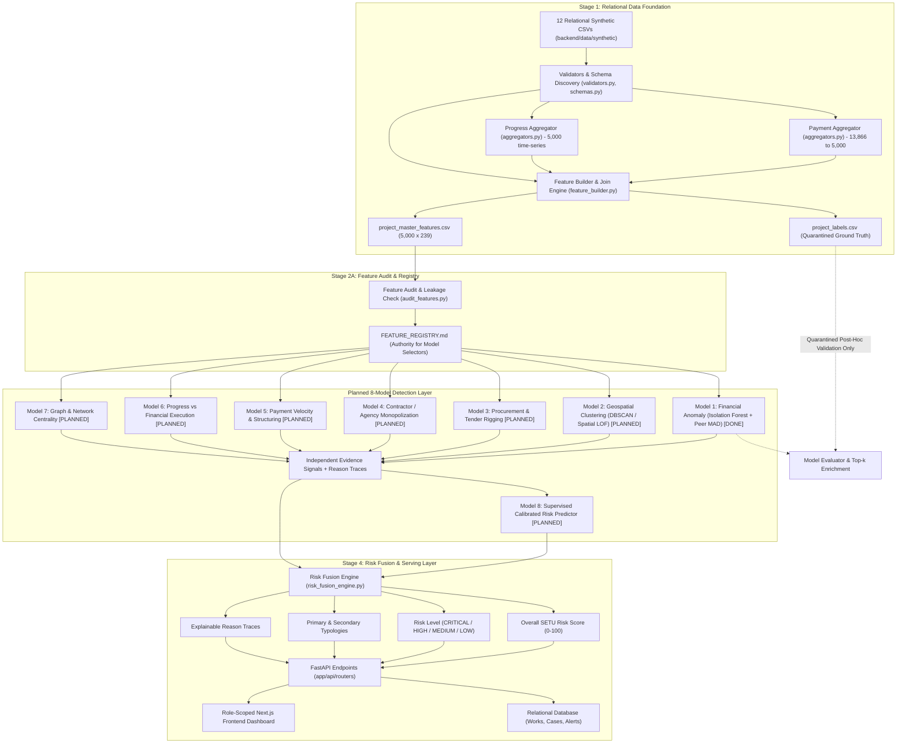
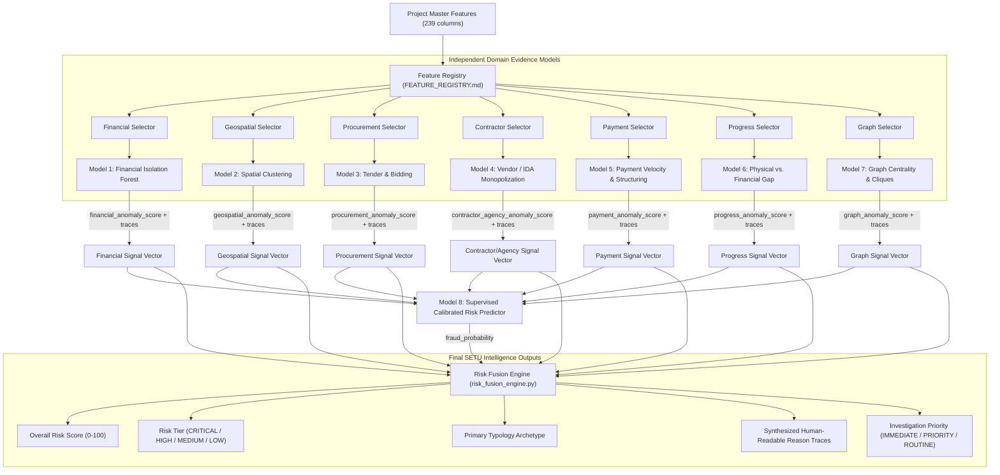

# SETU: Smart Evidence-based Triangulation for Uncovering Anomalies in MPLADS

> **Repository**: `Barath-j593/sih-2026`  
> **Domain**: Member of Parliament Local Area Development Scheme (MPLADS)  
> **Problem Statement**: SIH 2026 — Ministry of Statistics and Programme Implementation (MoSPI)  
> **System Scope**: Backend Data Foundation, ML Detection Models, Explainability Engine, and Multi-Signal Risk Fusion  

---

## Table of Contents

1. [Executive Summary & Purpose](#1-executive-summary--purpose)
2. [High-Level Backend Architecture](#2-high-level-backend-architecture)
3. [Data Foundation — The 12 Relational Datasets](#3-data-foundation--the-12-relational-datasets)
4. [Dataset Inventory & Relational Schema](#4-dataset-inventory--relational-schema)
5. [Stage 1 — Data Foundation & Aggregation Pipeline](#5-stage-1--data-foundation--aggregation-pipeline)
6. [Project Master Features (`project_master_features.csv`)](#6-project-master-features-project_master_featurescsv)
7. [Project Labels & Ground Truth Isolation (`project_labels.csv`)](#7-project-labels--ground-truth-isolation-project_labelscsv)
8. [Stage 2A — Feature Audit & Controlled Feature Registry](#8-stage-2a--feature-audit--controlled-feature-registry)
9. [Temporal Safety & Leakage Prevention Philosophy](#9-temporal-safety--leakage-prevention-philosophy)
10. [Stage 2B — Financial Anomaly Model (IMPLEMENTED)](#10-stage-2b--financial-anomaly-model-implemented)
11. [Current Model Artifacts & Audit Reports](#11-current-model-artifacts--audit-reports)
12. [Testing & Quality Assurance Suite](#12-testing--quality-assurance-suite)
13. [The Complete 8-Model Backend Roadmap](#13-the-complete-8-model-backend-roadmap)
14. [Model Pipeline & Downstream Fusion Flow](#14-model-pipeline--downstream-fusion-flow)
15. [Final Risk Fusion Engine Architecture](#15-final-risk-fusion-engine-architecture)
16. [Existing Baseline & Legacy Detection Signals](#16-existing-baseline--legacy-detection-signals)
17. [Directory Architecture (Current vs. Planned)](#17-directory-architecture-current-vs-planned)
18. [Developer Workflow for Future Model Contributors](#18-developer-workflow-for-future-model-contributors)
19. [Reproducibility & Determinism Standards](#19-reproducibility--determinism-standards)
20. [Evaluation Philosophy & Top-k Enrichment](#20-evaluation-philosophy--top-k-enrichment)
21. [Hard Negatives & Legitimate Outlier Discrimination](#21-hard-negatives--legitimate-outlier-discrimination)
22. [Explainability & Evidence Reason Traces](#22-explainability--evidence-reason-traces)
23. [Component Implementation Status Matrix](#23-component-implementation-status-matrix)
24. [Immediate Next Steps (Roadmap Execution)](#24-immediate-next-steps-roadmap-execution)
25. [Strict Development Invariants (Rules Never to Break)](#25-strict-development-invariants-rules-never-to-break)
26. [Running & Testing the System](#26-running--testing-the-system)
27. [Troubleshooting Guide](#27-troubleshooting-guide)
28. [Backend Handover & Contributor Guidance](#28-backend-handover--contributor-guidance)

---

## 1. Executive Summary & Purpose

**SETU** (*Smart Evidence-based Triangulation for Uncovering Anomalies in MPLADS*) is an intelligent backend data and machine-learning intelligence platform designed for automated anomaly detection, risk prioritization, and investigative support across public works funded by the Member of Parliament Local Area Development Scheme (MPLADS).

### Why SETU Exists

Under the MPLADS guidelines issued by the Ministry of Statistics and Programme Implementation (MoSPI), Members of Parliament recommend developmental projects in their constituencies across sectors such as drinking water, education, sanitation, road infrastructure, and public health. District Authorities (DAs) / District Magistrates (DMs) sanction, tender, supervise, and disburse public funds to Implementing District Agencies (IDAs) and contractors.

Monitoring thousands of concurrently active works across hundreds of districts presents substantial operational challenges:
* Discrepancies between sanctioned amounts, estimates, and actual disbursements.
* Unusual transaction velocity, round-sum disbursements, and unverified installment releases.
* Physical progress lagging severely behind cumulative financial releases.
* Geographic clustering, single-bid procurement monopolies, and repeated vendor-agency pairings.
* Irregularities in statutory documentation (e.g., missing Measurement Books, delayed Utilization Certificates, unverified asset geotags).

### Core Operational Principle: Evidence Triangulation

> **CRITICAL SYSTEM PRINCIPLE**:  
> **SETU identifies statistical risk and anomaly signals. It does NOT make a legal, administrative, or judicial determination of fraud.**

SETU operates on the principle of **multi-evidence triangulation**:
* A project having an unusually high cost or a single contractor bid is **not** inherently fraudulent—it may represent a remote, high-altitude bridge or an emergency flood-relief installation.
* SETU builds **independent domain-specific evidence detectors** (Financial, Geospatial, Procurement, Contractor/Agency, Payment, Progress, Graph/Network).
* Each detector assesses deviations against localized peer baselines (e.g., similar work types within the same district or category).
* A separate, downstream **Risk Fusion Engine** triangulates these independent signals. A high investigation priority is assigned only when multiple orthogonal anomalies converge on the same project or entity.

---

## 2. High-Level Backend Architecture

The backend pipeline follows a strict, modular, leakage-quarantined dataflow from raw relational records to role-scoped dashboard feeds and investigative case dossiers.



---

## 3. Data Foundation — The 12 Relational Datasets

The relational data foundation is structured around 12 normalized relational datasets. In the development environment, these are sourced from the **Sanchay-AI synthetic relational data generator** (used strictly as an external benchmark dataset generator; Sanchay-AI is an external data source and is not SETU itself).

These 12 datasets represent a coherent relational world centered around `project_id`:

```
01_projects (5,000)
 ├── 1:1 ── 02_financials (5,000)
 ├── 1:N ── 03_payments (13,866)
 ├── 1:N ── 04_progress (5,000 observations)
 ├── 1:1 ── 05_procurement (5,000)
 ├── 1:1 ── 06_contracts (5,000)
 ├── N:1 ── 07_contractors (400)
 ├── N:1 ── 08_agencies (1,238)
 ├── N:1 ── 09_geography (619 districts)
 ├── N:1 ── 10_constituencies (913 constituencies)
 ├── 1:1 ── 11_documents (5,000)
 └── 1:1 ── 12_labels (5,000 - Quarantined Ground Truth)
```

### Why One-to-Many Aggregation is Required

Machine learning models operating at project grain require **exactly one feature vector per project**. Raw transaction tables like `03_payments.csv` (13,866 payment installments) and `04_progress.csv` (multiple progress inspection points) cannot be directly joined into tabular model inputs without causing duplicate project rows or losing historical transaction signals.

Stage 1 resolves this by running deterministic, time-aware aggregators that summarize payment installment behavior and progress trajectories into fixed-width project-level feature sets.

---

## 4. Dataset Inventory & Relational Schema

Discovered and validated inventory from `backend/data/synthetic/`:

| Dataset File | Table Name | Row Count | Primary Key | Grain / Entity | Relational Role & Description |
| :--- | :--- | :---: | :--- | :--- | :--- |
| `01_projects.csv` | `projects` | **5,000** | `project_id` | Project | Central project master (title, work type, category, status, recommendation dates, MP/constituency/contractor links). |
| `02_financials.csv` | `financials` | **5,000** | `project_id` | Project | Approved allocations, administrative/technical sanction amounts, SOR vs market rates, revised estimates, utilization ratios. |
| `03_payments.csv` | `payments` | **13,866** | `payment_id` | Payment | Granular transaction records (installment numbers, release dates, milestone amounts, verification flags, payment methods). |
| `04_progress.csv` | `progress` | **5,000** | `progress_id` | Project / Progress | Progress monitoring records (physical % reported, financial % reported, inspection dates, delay flags, MB verification, geotags). |
| `05_procurement.csv` | `procurement` | **5,000** | `project_id` | Project | Tender process metrics (bidding type, tender dates, bidder counts, single-bid flags, estimated vs bid value, win margins). |
| `06_contracts.csv` | `contracts` | **5,000** | `project_id` | Project | Contract management (award dates, contract values, variation orders, completion deadlines, extension counts, liquidated damages). |
| `07_contractors.csv` | `contractors` | **400** | `contractor_id` | Contractor | Vendor profiles (registration tier, blacklisting history, capacity limits, shared director/ownership flags, turnover). |
| `08_agencies.csv` | `agencies` | **1,238** | `agency_id` | Agency | Implementing District Agency (IDA) profiles (agency type, district jurisdiction, staffing capacity, active project load). |
| `09_geography.csv` | `geography` | **619** | `district_id` | District | District context (state, terrain type, literacy rate, poverty index, infrastructure gap score, latitude/longitude). |
| `10_constituencies.csv`| `constituencies`| **913** | `constituency_id`| Constituency | Constituency context (Lok Sabha / Rajya Sabha house type, MP allocation pools, total sanctioned funds). |
| `11_documents.csv` | `documents` | **5,000** | `project_id` | Project | Statutory audit trail (Administrative/Technical Sanction, MB, DPR, UC/CC flags, tampering flags, OCR confidence scores). |
| `12_labels.csv` | `labels` | **5,000** | `project_id` | Project | Synthetic ground-truth validation labels (**quarantined** from ML feature stores). |

---

## 5. Stage 1 — Data Foundation & Aggregation Pipeline

**Status**: `DONE`  
**Core Modules**:
* `backend/app/ml/data/schemas.py`: Canonical schema definitions, column types, and leakage lists.
* `backend/app/ml/data/validators.py`: Primary-key uniqueness, foreign-key integrity, and temporal validity checks.
* `backend/app/ml/data/aggregators.py`: Payment and progress transaction aggregators.
* `backend/app/ml/data/feature_builder.py`: Multi-source joiner and master feature compiler.
* `backend/app/ml/data/setu_data_layer.py`: Stage 1 end-to-end orchestration pipeline.

### Validation Results
* **16 Foreign-Key Relationships Validated**: `PASS` (0 orphan records, 0 null foreign keys).
* **Primary-Key Uniqueness**: `PASS` (0 duplicate keys across all 12 tables).
* **Referential Integrity Loss**: `0 lost projects` (exactly 5,000 project rows maintained throughout joins).

### Transaction Aggregators

#### 1. Payment Aggregator (`03_payments.csv` $\rightarrow$ 29 Features)
Converts 13,866 transaction rows into 29 project-level behavioral metrics:
* **Volume & Sizing**: `pay_count`, `pay_total_amount`, `pay_avg_amount`, `pay_std_amount`, `pay_min_amount`, `pay_max_amount`, `pay_median_amount`.
* **Timing & Intervals**: `pay_span_days`, `pay_inter_payment_mean_days`, `pay_inter_payment_std_days`, `pay_inter_payment_min_days`, `pay_inter_payment_max_days`.
* **Velocity & Acceleration**: `pay_amount_velocity_per_day` (funds released per calendar day), `pay_frequency_per_month`, `pay_acceleration`.
* **Disbursement Concentration & Entropy**: `pay_max_share_of_total` (max installment ratio), `pay_entropy` (Shannon entropy of payment distributions).
* **Anomaly Indicators**: `pay_same_day_payment_count`, `pay_round_amount_fraction` (fraction of round numbers ending in 00,000), `pay_unverified_count`, `pay_unverified_ratio`, `pay_final_installment_ratio`.

#### 2. Progress Aggregator (`04_progress.csv` $\rightarrow$ 26 Features)
Summarizes inspection points into progress trajectories:
* **Observation Count & Trajectory**: `prog_report_count`, `prog_days_since_latest_report`.
* **Current Status**: `prog_latest_physical_progress`, `prog_latest_financial_progress`, `prog_latest_planned_progress`.
* **Discrepancy Metrics**: `prog_financial_physical_gap` (financial % minus physical %), `prog_actual_vs_planned_gap` (physical % minus planned %).
* **Time-Aware Slopes**: Slopes are computed strictly against **elapsed calendar days** (not arbitrary row index): `prog_physical_slope_per_day`, `prog_financial_slope_per_day`, `prog_expenditure_acceleration`.
* **Execution Obstacles**: `prog_delay_count`, `prog_reported_delay_days`, `prog_extension_count`, `prog_extension_days`.
* **Verification & Geotagging**: `prog_geotag_available_fraction`, `prog_geotag_mismatch_count`, `prog_mb_verified_fraction`.

---

## 6. Project Master Features (`project_master_features.csv`)

**Status**: `DONE`  
**File Location**: `backend/app/ml/data/processed/project_master_features.csv`  
**Dimensions**: **5,000 rows** $\times$ **239 columns** (exactly 1 row per project).

### Standardized Feature Group Prefixes
Every feature name carries an explicit prefix denoting its source domain, ensuring clear lineage:

| Prefix Group | Description | Column Count |
| :--- | :--- | :---: |
| `unprefixed` | Core project identifiers and top-level metadata (`project_id`, `work_type`, `category`, `status`, etc.) | 6 |
| `project__` | Master project metadata (recommendation dates, estimated costs, execution targets) | 18 |
| `financial__` | Financial approvals, SOR benchmarks, sanction deviations, utilization ratios | 28 |
| `payment__` | Aggregated installment metrics, payment velocity, entropy, round amounts | 28 |
| `progress__` | Physical vs. financial progress gaps, execution slopes, geotag consistency | 25 |
| `procurement__`| Bidding types, tender durations, competition counts, single-bid indicators | 22 |
| `contract__` | Contract award values, time extensions, variation orders, contractor links | 19 |
| `contractor__` | Contractor historical performance, capacity utilization, shared director links | 31 |
| `agency__` | Implementing agency workload, district concentration, staff capacity | 3 |
| `geo__` | District demographic, economic, and infrastructure context indices | 8 |
| `constituency__`| Constituency pool size, MP house allocation metrics | 1 |
| `document__` | Statutory audit trail completeness, OCR verification, MB/UC/CC presence | 50 |
| **Total** | **All Combined Feature Groups** | **239** |

---

## 7. Project Labels & Ground Truth Isolation (`project_labels.csv`)

**Status**: `DONE`  
**File Location**: `backend/app/ml/data/processed/project_labels.csv`  
**Dimensions**: **5,000 rows** $\times$ **10 columns**

```
Target Label Quarantine Policy:
┌────────────────────────────────────────────────────────────────────────┐
│  project_master_features.csv (239 cols)  ──>  ZERO TARGET COLUMNS      │
│  project_labels.csv (10 cols)            ──>  QUARANTINED REPOSITORY   │
└────────────────────────────────────────────────────────────────────────┘
```

### Label Fields
* `project_id`: Relational primary key.
* `fraud_label` & `is_fraud`: Binary indicator (1 = fraudulent scenario, 0 = benign).
* `is_anomalous`: Anomaly flag.
* `is_hard_negative`: Indicator for complex, high-value, or remote projects that appear anomalous but are entirely legitimate (e.g., `HIGH_VALUE_LEGITIMATE`, `LEGITIMATE_REMOTE_SINGLE_BID`).
* `risk_level`: Ground-truth risk category (`LOW`, `MEDIUM`, `HIGH`, `CRITICAL`).
* `scenario_type` & `scenario_name`: Specific typology archetype (e.g., `COST_OVERRUN`, `ABANDONED_WORK`, `ROUND_TRIPPING_VENDOR`, `GHOST_PROJECT`).
* `overall_risk_score`: Calibrated synthetic risk score (`0.0 - 100.0`).
* `investigation_priority`: Triage urgency (`ROUTINE`, `PRIORITY`, `IMMEDIATE`).

> **STRICT USAGE RULE**:  
> `project_labels.csv` is **NEVER** merged into feature training matrices. It is loaded strictly in post-scoring evaluation modules to benchmark fraud enrichment, top-k precision, and hard-negative suppression.

---

## 8. Stage 2A — Feature Audit & Controlled Feature Registry

**Status**: `DONE`  
**Key Deliverables**:
* `backend/app/ml/data/reports/FEATURE_REGISTRY.md`: Authoritative dictionary of all 239 features.
* `backend/app/ml/data/reports/feature_audit.json`: Machine-readable audit report.

### Audit Summary Across 239 Columns

| Classification | Count | Description / Treatment |
| :--- | :---: | :--- |
| `NUMERICAL` | **142** | Continuous / discrete numeric values eligible for statistical scaling and ML inputs. |
| `CATEGORICAL` | **19** | Categorical variables (e.g., `work_type`, `category`) eligible for one-hot encoding or peer grouping. |
| `TEMPORAL` | **15** | Timestamps / dates transformed into interval features (e.g., days elapsed) rather than raw strings. |
| `IDENTIFIER` | **7** | Unique entity IDs (`project_id`, `contractor_id`, etc.) retained for relational routing; stripped from ML tensors. |
| `EXCLUDE` | **56** | Identity strings (names, raw titles), zero-variance constants, or target-derived columns. |

### Temporal Availability Classification
* **Safe Early-Warning Features**: **221 columns** (available during active project execution).
* **Retrospective-Only Features**: **11 columns** (known only upon project completion, e.g., `actual_completion_date`, `utilization_certificate`).
* **Not Applicable**: **7 columns** (Identifiers).

---

## 9. Temporal Safety & Leakage Prevention Philosophy

To serve as an operational early-warning system for District Magistrates and Ministry auditors, SETU enforces strict temporal and leakage controls:

1. **Explicit Model Modes**: Every model configuration must declare its operational mode:
   ```python
   mode = "early_warning"  # Excludes retrospective completion features
   ```
2. **Zero Target Leakage**: Master feature tables contain zero target columns, scenario descriptions, or synthetic ground-truth labels.
3. **Identity Stripping**: Textual entities (`mp_name`, `contractor_name`, `agency_name`, `work_title`) are excluded from model tensors to prevent algorithms from overfitting to specific individual names.
4. **Time-Aware Transformations**: Timestamps are converted to durations (e.g., `days_since_sanction`, `inter_payment_days`).

---

## 10. Stage 2B — Financial Anomaly Model (IMPLEMENTED)

**Status**: `DONE`  
**Implementation Directory**: `backend/app/ml/models/financial/`

The Financial Anomaly Model is the first of SETU's 8 independent evidence detectors. It evaluates whether a project's financial profile deviates significantly from peer projects undertaking similar works.

### Model Architecture & Configuration
* **Algorithm**: Unsupervised **Isolation Forest** with peer-adjusted normalization.
* **Hyperparameters**:
  * `n_estimators`: `200`
  * `max_samples`: `"auto"` (256)
  * `contamination`: `0.05` (top 5% expected anomaly rate)
  * `random_state`: `42` (deterministic seed)
  * `mode`: `"early_warning"`

### 40-Feature Input Matrix
* **29 Base Early-Warning Features**: Sanctioned vs. estimated amounts, cost discrepancy ratios, payment count, payment velocity, disbursement entropy, round-amount fraction, same-day payments, unverified disbursements.
* **11 Engineered Peer-Normalized Features**: Robust deviations calculated against projects with the same `work_type` (falling back to `work_category` if peer group size $< 5$):
  $$\text{Robust } Z = \frac{x - \text{Median}(X_{\text{peer}})}{1.4826 \times \text{MAD}(X_{\text{peer}}) + \epsilon}$$
  Engineered features include: `peer__cost_work_type_robust_z`, `peer__unit_cost_work_type_robust_z`, `peer__velocity_work_type_robust_z`, `peer__entropy_work_type_robust_z`, `peer__same_day_work_type_robust_z`, `peer__round_amt_work_type_robust_z`, etc.

### Score Calibration & Outputs
* **`financial_anomaly_score`**: Calibrated continuous score from `0.0` (benign) to `100.0` (extreme anomaly).
* **`financial_anomaly_percentile`**: Population percentile rank (`0.0 - 100.0`).
* **`is_financial_anomaly`**: Boolean flag set to `True` for projects in the top 5% ($\ge 95\text{th}$ percentile).
* **Reason Traces**: Three human-readable traces explaining specific feature contributions (`primary_reason`, `secondary_reason`, `tertiary_reason`).

### Performance & Validation Results

* **Projects Scored**: 5,000
* **Flagged Anomalies**: 250 (5.0%)
* **Score Distribution**: Mean = `28.26`, Median = `19.34`, p75 = `37.26`, p90 = `66.50`, p95 = `79.25`, p99 = `93.18`.

#### Fraud Enrichment on Ground-Truth Scenarios (Base Prevalence = 20.10%)
| Project Subset | Project Count | Fraud Projects | Subset Fraud Rate | Enrichment Factor |
| :--- | :---: | :---: | :---: | :---: |
| **Top 1% Anomaly Scores** | 50 | 43 | **86.00%** | **4.28x** |
| **Top 5% Anomaly Scores** | 250 | 172 | **68.80%** | **3.42x** |
| **Top 10% Anomaly Scores** | 500 | 324 | **64.80%** | **3.22x** |

#### Comparison Against Standard Baselines
| Detector / Baseline | Top 1% Fraud Rate | Top 5% Fraud Rate | Top 10% Fraud Rate | Top 10% Enrichment |
| :--- | :---: | :---: | :---: | :---: |
| **Baseline 1: Peer Cost Deviation** | 10.00% | 10.00% | 9.60% | 0.48x |
| **Baseline 2: Multi-Attribute Robust Z** | 28.00% | 20.80% | 17.00% | 0.85x |
| **SETU Stage 2B Isolation Forest** | **86.00%** | **68.80%** | **64.80%** | **3.22x** |

#### Hard-Negative Discrimination
* **Benign Normal Projects (`NORMAL`)**: Mean score = **17.1 / 100** (0.0% flagged in top 5%).
* **High-Value Legitimate Works (`HIGH_VALUE_LEGITIMATE`)**: Peer normalization suppresses false alarms from project scale alone.
* **Cost Overrun Scenarios (`COST_OVERRUN`)**: Mean score = **74.9 / 100** (81.7% captured in top 10%).

*(Note: Ground-truth metrics benchmark model discrimination on synthetic reference scenarios and do not constitute legal determinations).*

---

## 11. Current Model Artifacts & Audit Reports

The Financial Anomaly Model serializes complete, reproducible production artifacts under `backend/app/ml/models/financial/artifacts/`:

| Artifact File | Format | Purpose & Contents |
| :--- | :---: | :--- |
| `financial_isolation_forest.joblib` | Binary | Fitted Scikit-Learn `IsolationForest` estimator. |
| `financial_preprocessor.joblib` | Binary | Fitted `FinancialPreprocessor` pipeline (peer medians, MAD lookup tables, `RobustScaler`). |
| `financial_features.json` | JSON | Exact list of 40 active feature names used during training. |
| `financial_model_config.json` | JSON | Serialized `FinancialModelConfig` dataclass parameters. |
| `financial_model_metadata.json` | JSON | Model version (`1.0.0`), training timestamp, and feature counts. |
| `training_summary.json` | JSON | Summary statistics of training score distributions and runtime. |

### Reports
* **`backend/app/ml/reports/financial_model_report.json`**: Comprehensive machine-readable evaluation report containing score quantiles, fraud enrichment tables, baseline comparisons, and scenario breakdowns.
* **`backend/app/ml/reports/FINANCIAL_MODEL_REPORT.md`**: Human-readable markdown audit summary for review.
* **`backend/app/ml/data/processed/financial_anomaly_scores.csv`**: Scored dataset for all 5,000 projects containing scores, percentiles, flags, peer metrics, and reason traces.

---

## 12. Testing & Quality Assurance Suite

**Test Execution Status**: **31/31 Tests Passing (100%)**

The test suite enforces referential integrity, zero data leakage, determinism, and model inference validity:

```
backend/tests/ml/
├── data/
│   ├── test_aggregators.py             (2 tests: payment determinism, progress slopes)
│   ├── test_determinism.py             (1 test: end-to-end data pipeline determinism)
│   ├── test_feature_audit.py           (7 tests: 239 column classification, leakage quarantine)
│   ├── test_feature_builder.py         (4 tests: 1 row/project, prefixing, identity exclusion)
│   ├── test_leakage.py                 (2 tests: zero target columns in master features)
│   └── test_referential_integrity.py   (4 tests: PK/FK checks, orphan handling, duplicate detection)
└── models/
    └── test_financial_model.py         (10 tests: input integrity, output 5,000 rows, score range 0-100,
                                         early-warning safety, preprocessor/model determinism,
                                         artifact reloading, baseline validity, reason traces)
```

Run all ML tests:
```bash
pytest backend/tests/ml/ -v
```

---

## 13. The Complete 8-Model Backend Roadmap

SETU decomposes public works anomaly detection into **8 distinct, specialized models**. Seven models generate orthogonal domain-specific evidence signals; the eighth is a downstream supervised risk predictor.

```
┌──────────────────────────────────────────────────────────────────────────────────┐
│                             SETU ML Roadmap Overview                             │
├──────────────────────────────────────────────────────────────────────────────────┤
│  Model 1: Financial Anomaly Detection              ─── [STATUS: DONE]            │
│  Model 2: Geospatial & Spatial Clustering          ─── [STATUS: PLANNED]         │
│  Model 3: Procurement & Tender Rigging             ─── [STATUS: PLANNED]         │
│  Model 4: Contractor / Agency Monopolization       ─── [STATUS: PLANNED]         │
│  Model 5: Payment Velocity & Structuring           ─── [STATUS: PLANNED]         │
│  Model 6: Progress vs. Execution Trajectory        ─── [STATUS: PLANNED]         │
│  Model 7: Graph & Entity Network Centrality        ─── [STATUS: PLANNED]         │
│  Model 8: Supervised Calibrated Risk Predictor     ─── [STATUS: PLANNED]         │
└──────────────────────────────────────────────────────────────────────────────────┘
```

---

### MODEL 1 — Financial Anomaly Detection
* **Status**: `DONE`
* **Purpose**: Detect unusual financial sizing, estimate discrepancies, and cost overruns relative to localized peer benchmarks.
* **Technique**: Unsupervised Isolation Forest with Median/MAD peer-adjusted normalization across `work_type` and `work_category`.
* **Primary Features**: Unit costs, sanction-to-estimate ratios, payment velocity, round amounts, entropy, peer robust Z-scores.
* **Primary Output**: `financial_anomaly_score` (`0.0 - 100.0`), `is_financial_anomaly` (boolean), reason traces.

---

### MODEL 2 — Geospatial / Spatial Anomaly Detection
* **Status**: `PLANNED`
* **Purpose**: Identify abnormal geographic clustering, spatial cost disparities, and implausible distance-to-capacity distributions.
* **Potential Signals**: Project GPS coordinates, village density, distance between concurrent projects executed by the same contractor, local spatial cost variance relative to neighboring districts.
* **Candidate Techniques**: Spatial DBSCAN / HDBSCAN, Spatial Local Outlier Factor (Spatial LOF), spatial kernel density estimation.
* **Expected Output**: `geospatial_anomaly_score` (`0.0 - 100.0`), spatial cluster IDs, geographic outlier flags.

---

### MODEL 3 — Procurement & Tender Anomaly Detection
* **Status**: `PLANNED`
* **Purpose**: Detect tender rigging, single-bid dominance, bid suppression, and artificial quotation clustering.
* **Potential Signals**: Single-bidder rates, tender submission duration windows, bid spread variance, winning margin distributions, tender cancellation/re-tender frequency, procurement method bypass indicators.
* **Candidate Techniques**: Statistical Benford/distributional testing, rule-calibrated tender scoring, Isolation Forest on bidding dynamics.
* **Expected Output**: `procurement_anomaly_score` (`0.0 - 100.0`), procurement risk flags, tender anomaly traces.

---

### MODEL 4 — Contractor & Implementing Agency Anomaly Detection
* **Status**: `PLANNED`
* **Purpose**: Uncover vendor capture, agency monopolization, capacity over-allocation, and suspicious corporate linkages.
* **Potential Signals**: MP-to-IDA fund concentration, contractor project backlog vs. registered financial capacity, shared corporate directors, identical registration addresses, rapid ownership changes, consecutive contract awards.
* **Candidate Techniques**: Entity-level aggregation, capacity strain index, entity anomaly scoring.
* **Expected Output**: `contractor_agency_anomaly_score` (`0.0 - 100.0`), monopoly ratios, entity strain flags.

---

### MODEL 5 — Payment Anomaly Detection
* **Status**: `PLANNED`
* **Purpose**: Detect transaction-level disbursement anomalies, smurfing/structuring, rapid payment bursts, and unverified releases.
* **Potential Signals**: High-frequency same-day disbursements, statutory threshold smurfing (disbursements just under statutory ceiling limits, e.g., ₹14.99L vs. ₹15.00L), sudden unverified releases, distorted final installment spikes.
* **Candidate Techniques**: Sequential transaction anomaly detection, inter-payment interval modeling, disbursement entropy analysis.
* **Expected Output**: `payment_anomaly_score` (`0.0 - 100.0`), structuring flags, payment reason traces.

---

### MODEL 6 — Progress / Execution Anomaly Detection
* **Status**: `PLANNED`
* **Purpose**: Detect physical execution stalling, ghost project indicators, and severe divergence between financial expenditure and ground physical progress.
* **Potential Signals**: High financial expenditure with near-zero physical progress (`prog_financial_physical_gap`), stalled project milestones (>180 days without progress update), missing Measurement Books, inconsistent geotag availability.
* **Candidate Techniques**: Trajectory slope divergence analysis, survival/stall proxy modeling, time-to-milestone deviation.
* **Expected Output**: `progress_anomaly_score` (`0.0 - 100.0`), stall flags, execution gap metrics.

---

### MODEL 7 — Graph & Network Relationship Anomaly Detection
* **Status**: `PLANNED`
* **Purpose**: Model the multi-entity MPLADS ecosystem as a heterogeneous graph to detect collusive cliques, circular bidding, and dense procurement subgraphs.
* **Graph Topology**:
  * *Nodes*: Projects, MPs, Constituencies, Implementing Agencies (IDAs), Contractors, Districts.
  * *Edges*: Recommendation (`MP -> Project`), Jurisdiction (`Constituency -> Project`), Execution (`Project -> IDA`), Contracting (`Project -> Contractor`), Collaboration (`Contractor -> IDA`).
* **Candidate Techniques**: NetworkX bipartite/heterogeneous graph analysis, PageRank / Degree centrality anomalies, community detection (Louvain), dense subgraph mining.
* **Expected Output**: `graph_anomaly_score` (`0.0 - 100.0`), network risk metrics, community clique IDs.

---

### MODEL 8 — Supervised Fraud & Risk Prediction Model
* **Status**: `PLANNED (Downstream Layer)`
* **Purpose**: Combine validated evidence scores from Models 1–7 alongside non-leaking contextual features to predict the calibrated probability of specific fraud typologies.
* **Candidate Inputs**:
  * Output scores: `financial_anomaly_score`, `geospatial_anomaly_score`, `procurement_anomaly_score`, `contractor_agency_anomaly_score`, `payment_anomaly_score`, `progress_anomaly_score`, `graph_anomaly_score`.
  * Context features: Project scale, work category, district development indices.
* **Candidate Techniques**: Calibrated Gradient Boosting (XGBoost / LightGBM) with stratified train/validation/test splits and cost-sensitive class weighting.
* **Evaluation Requirement**: Must be evaluated rigorously against `is_hard_negative` to ensure legitimate complex works are not misclassified.
* **Expected Output**: `fraud_probability` (`0.0 - 1.0`), calibrated risk rating.

---

## 14. Model Pipeline & Downstream Fusion Flow

The interaction between feature extraction, independent evidence models, and final risk fusion:



---

## 15. Final Risk Fusion Engine Architecture

The Risk Fusion Engine (`backend/app/ml/models/risk_fusion_engine.py`) serves as the **final evidence-combination layer**.

### Core Architecture Rules
1. **Architectural Separation**: Individual detection models (Models 1–7) **never** overwrite or replace the fusion engine. They produce intermediate evidence signals.
2. **Sub-Score Normalization**: Each evidence vector is normalized to a continuous sub-score (`0.0 - 100.0`).
3. **Typology Mapping**: When multiple orthogonal sub-scores are elevated, the fusion engine identifies the primary fraud archetype (e.g., `COST_OVERRUN`, `VENDOR_CAPTURE`, `GHOST_PROJECT`, `BID_RIGGING`).
4. **Reason Synthesis**: The engine collects reason traces from all triggered models into a coherent audit narrative for investigators.

---

## 16. Existing Baseline & Legacy Detection Signals

Before the introduction of the modular ML pipeline, initial hackathon baselines were implemented under `backend/app/ml/features/` and `backend/app/ml/models/`:

| Signal / Detector | Implementation File | Status | Evolutionary Role |
| :--- | :--- | :--- | :--- |
| **Peer Cost Z-Score** | `features/peer_zscore.py` | `ACTIVE BASELINE` | Univariate baseline; superseded by Stage 2B Median/MAD Isolation Forest. |
| **Duplicate Work Detector** | `features/duplicate_detector.py` | `ACTIVE BASELINE` | Exact match grouping; retained as a deterministic rule heuristic. |
| **Fuzzy Duplicate Detector** | `features/fuzzy_duplicate.py` | `ACTIVE BASELINE` | TF-IDF fuzzy cosine similarity on work descriptions. |
| **Contract Structuring Detector**| `features/structuring_detector.py`| `ACTIVE BASELINE` | Threshold smurfing detector (near ₹15L statutory ceiling); to be incorporated into Model 5. |
| **Vendor Concentration** | `features/vendor_concentration.py`| `ACTIVE BASELINE` | MP-to-IDA monopolization ratios; to be incorporated into Model 4. |
| **Stall / Ghost Detector** | `features/stall_detector.py` | `ACTIVE BASELINE` | Elapsed days without sanction; to be incorporated into Model 6. |
| **Legacy Isolation Forest** | `models/isolation_forest_model.py`| `LEGACY` | Initial flat Isolation Forest; superseded by Stage 2B (`models/financial/`). |
| **Legacy LOF Model** | `models/lof_model.py` | `LEGACY` | Local Outlier Factor prototype; available as a comparison benchmark. |
| **Legacy XGBoost Model** | `models/xgboost_classifier.py` | `LEGACY` | Initial classifier; to be superseded by Model 8 post-evidence integration. |

---

## 17. Directory Architecture (Current vs. Planned)

```
backend/
├── app/
│   ├── main.py                               # FastAPI application entrypoint
│   ├── core/                                 # Configuration, database session, JWT auth
│   ├── models/                               # SQLAlchemy ORM models (Work, MP, IDA, Case, Alert)
│   ├── schemas/                              # Pydantic request/response schemas
│   ├── api/routers/                          # API endpoints (dashboard, works, geo, cases, reports)
│   ├── services/                             # Business logic & query aggregation
│   │
│   └── ml/
│       ├── data/                             # [CURRENT - DONE] Data foundation & aggregation layer
│       │   ├── schemas.py                    # Schema registry & leakage definitions
│       │   ├── validators.py                 # PK/FK & integrity validators
│       │   ├── aggregators.py                # Payment & progress transaction aggregators
│       │   ├── feature_builder.py            # Master feature compiler & label isolator
│       │   ├── audit_features.py             # Feature audit & classification runner
│       │   ├── setu_data_layer.py            # Stage 1 pipeline CLI runner
│       │   ├── DATA_DICTIONARY.md            # Comprehensive 239-feature dictionary
│       │   │
│       │   ├── processed/                    # [CURRENT - DONE] Generated datasets
│       │   │   ├── project_payment_features.csv   (5,000 x 29)
│       │   │   ├── project_progress_features.csv  (5,000 x 26)
│       │   │   ├── project_master_features.csv    (5,000 x 239)
│       │   │   ├── project_labels.csv             (5,000 x 10 - Quarantined)
│       │   │   └── financial_anomaly_scores.csv   (5,000 x 17)
│       │   │
│       │   └── reports/                      # [CURRENT - DONE] Audit reports
│       │       ├── schema_report.json
│       │       ├── referential_integrity_report.json
│       │       ├── feature_build_report.json
│       │       ├── feature_audit.json
│       │       ├── FEATURE_REGISTRY.md
│       │       ├── financial_features_recommended.json
│       │       └── geospatial_features_recommended.json
│       │
│       ├── features/                         # [CURRENT - ACTIVE] Baseline heuristic detectors
│       │   ├── peer_zscore.py
│       │   ├── duplicate_detector.py
│       │   ├── fuzzy_duplicate.py
│       │   ├── structuring_detector.py
│       │   ├── vendor_concentration.py
│       │   └── stall_detector.py
│       │
│       ├── models/                           # ML models directory
│       │   ├── financial/                    # [CURRENT - DONE] Stage 2B Financial Anomaly Model
│       │   │   ├── __init__.py
│       │   │   ├── config.py                 # FinancialModelConfig dataclass
│       │   │   ├── preprocessor.py           # Feature selector, peer Median/MAD engine, RobustScaler
│       │   │   ├── baseline_detectors.py     # Univariate & Multi-Z score benchmark baselines
│       │   │   ├── isolation_forest_model.py # Calibrated Isolation Forest & reason trace engine
│       │   │   ├── evaluator.py              # Distribution, fraud enrichment, hard-negative evaluator
│       │   │   ├── pipeline.py               # End-to-end model training & scoring CLI runner
│       │   │   └── artifacts/                # Serialized model joblib/json artifacts
│       │   │
│       │   ├── geospatial/                   # [PLANNED - Stage 2C] Spatial clustering model
│       │   ├── procurement/                  # [PLANNED - Stage 2D] Tender anomaly model
│       │   ├── contractor/                   # [PLANNED - Stage 2E] Vendor / IDA anomaly model
│       │   ├── payment/                      # [PLANNED - Stage 2F] Payment anomaly model
│       │   ├── progress/                     # [PLANNED - Stage 2G] Progress execution model
│       │   ├── graph/                        # [PLANNED - Stage 2H] Graph relationship model
│       │   ├── supervised/                   # [PLANNED - Stage 3] Supervised risk classifier
│       │   │
│       │   ├── risk_fusion_engine.py         # [CURRENT - SEPARATE] Multi-signal fusion engine
│       │   └── model_registry.py             # [CURRENT] Model metadata registry
│       │
│       └── reports/                          # [CURRENT - DONE] ML evaluation reports
│           ├── financial_model_report.json
│           └── FINANCIAL_MODEL_REPORT.md
│
├── data/
│   └── synthetic/                            # [CURRENT] 12 raw synthetic CSV datasets
│
└── tests/
    └── ml/                                   # [CURRENT - DONE] ML automated test suite (31 tests)
        ├── data/                             # Stage 1 & Stage 2A tests (21 tests)
        └── models/                           # Stage 2B financial model tests (10 tests)
```

---

## 18. Developer Workflow for Future Model Contributors

When implementing subsequent detection models (Stage 2C through Stage 2H), developers must follow this systematic 15-step protocol:

```
┌──────────────────────────────────────────────────────────────────────────────────┐
│                   Standard Model Development Lifecycle (15 Steps)                │
├──────────────────────────────────────────────────────────────────────────────────┤
│   1. Inspect domain-relevant features in project_master_features.csv             │
│   2. Consult FEATURE_REGISTRY.md for column safety and missingness               │
│   3. Create package under backend/app/ml/models/<domain>/                        │
│   4. Define <Domain>ModelConfig dataclass with deterministic random_state        │
│   5. Enforce temporal safety (mode = 'early_warning')                            │
│   6. Implement preprocessor (feature extraction, imputation, scaling)            │
│   7. Implement baseline detector for benchmarking                                │
│   8. Implement core ML / statistical detection algorithm                         │
│   9. Calibrate continuous output scores (0.0 - 100.0) and percentile ranks       │
│  10. Implement explainable reason trace generator (primary/secondary/tertiary)   │
│  11. Implement evaluator for top-k enrichment (Top 1%, 5%, 10%)                  │
│  12. Benchmark against hard negatives (is_hard_negative / HIGH_VALUE_LEGITIMATE) │
│  13. Build pipeline.py to train, score, serialize artifacts, and export reports │
│  14. Write dedicated pytest test suite under backend/tests/ml/models/            │
│  15. STOP and conduct architectural review BEFORE modifying risk_fusion_engine   │
└──────────────────────────────────────────────────────────────────────────────────┘
```

---

## 19. Reproducibility & Determinism Standards

To ensure consistent auditability across environments:
* **Fixed Random Seeds**: All stochastic components (Isolation Forest, train-test splits) must use `random_state = 42`.
* **Config Dataclasses**: Hyperparameters must be encapsulated in structured dataclasses and serialized to JSON alongside models.
* **Feature Manifests**: The exact ordered list of input feature names must be serialized to `features.json` to prevent feature-order mismatch during inference.
* **Deterministic Pipelines**: Data preprocessing and aggregators must produce bitwise identical outputs across runs.

---

## 20. Evaluation Philosophy & Top-k Enrichment

Standard machine learning metrics (such as raw accuracy or unweighted ROC-AUC) are insufficient for public works fraud detection due to extreme class imbalance and operational triage constraints.

SETU prioritizes **operational prioritization metrics**:

1. **Top-k Fraud Enrichment Factor**:
   $$\text{Enrichment@k} = \frac{\text{Fraud Rate in Top } k\% \text{ Scored Projects}}{\text{Baseline Ground Truth Fraud Prevalence}}$$
   Measures how effectively the anomaly score concentrates suspicious works into the top investigative triage queue.
2. **Top-k Precision (`Precision@k`)**: The fraction of true fraudulent scenarios within the top 50, 250, or 500 flagged projects.
3. **Hard-Negative False Positive Rate**: The percentage of benign but complex projects falsely flagged in the top 5%.
4. **Scenario-Level Sensitivity**: Recall broken down across specific typologies (`COST_OVERRUN`, `ABANDONED_WORK`, `BID_RIGGING`, etc.).

---

## 21. Hard Negatives & Legitimate Outlier Discrimination

A critical flaw in naive anomaly detection is flagging legitimate high-value infrastructure projects (e.g., major highway bypasses, district hospital wards) as anomalies simply due to high absolute expenditure.

SETU explicitly tests and calibrates models against `is_hard_negative` ground truth scenarios:
* **`HIGH_VALUE_LEGITIMATE`**: Large-scale projects with high sanctioned amounts but normal peer unit costs and linear physical execution.
* **`LEGITIMATE_REMOTE_SINGLE_BID`**: Remote geographical projects where single-bid procurement is legitimate due to difficult terrain.
* **`LEGITIMATE_WEATHER_DELAY`**: Works delayed due to monsoon flooding with appropriate statutory extension documentation.

Models must demonstrate score separation between legitimate outliers and true suspicious anomalies through peer-adjusted normalization.

---

## 22. Explainability & Evidence Reason Traces

> **SETU PRINCIPLE**: Black-box flags like `ANOMALY_DETECTED` are unacceptable for government audit workflows.

Every model must accompany its numeric anomaly score with **three ranked, human-interpretable reason traces**:
* **Primary Reason**: The dominant statistical or domain driver (e.g., `High peer velocity work type robust z (+8.19 sigma above peer median)`).
* **Secondary Reason**: The secondary contributing factor (e.g., `Elevated round amount fraction of payments (85.7%)`).
* **Tertiary Reason**: Additional contextual evidence (e.g., `High same-day payment frequency (4 payments)`).

---

## 23. Component Implementation Status Matrix

| Component / Subsystem | Stage | Status | File / Artifact Path |
| :--- | :---: | :---: | :--- |
| **12-Source Schema Discovery** | Stage 1 | `DONE` | `backend/app/ml/data/schemas.py` |
| **Referential Integrity Validation** | Stage 1 | `DONE` | `backend/app/ml/data/validators.py` |
| **Payment Aggregator (13,866 $\rightarrow$ 5,000)** | Stage 1 | `DONE` | `backend/app/ml/data/aggregators.py` |
| **Progress Aggregator (Time-aware slopes)**| Stage 1 | `DONE` | `backend/app/ml/data/aggregators.py` |
| **Project Master Features (5,000 x 239)** | Stage 1 | `DONE` | `backend/app/ml/data/processed/project_master_features.csv` |
| **Ground Truth Label Quarantine** | Stage 1 | `DONE` | `backend/app/ml/data/processed/project_labels.csv` |
| **239-Column Feature Audit** | Stage 2A | `DONE` | `backend/app/ml/data/reports/feature_audit.json` |
| **Controlled Feature Registry** | Stage 2A | `DONE` | `backend/app/ml/data/reports/FEATURE_REGISTRY.md` |
| **Financial Anomaly Model** | Stage 2B | `DONE` | `backend/app/ml/models/financial/` |
| **Financial Model Production Artifacts** | Stage 2B | `DONE` | `backend/app/ml/models/financial/artifacts/` |
| **Financial Model Audit Reports** | Stage 2B | `DONE` | `backend/app/ml/reports/FINANCIAL_MODEL_REPORT.md` |
| **Automated ML Test Suite (31 tests)** | Stages 1-2B| `DONE` | `backend/tests/ml/` |
| **Geospatial Anomaly Model** | Stage 2C | `PLANNED`| `backend/app/ml/models/geospatial/` |
| **Procurement Anomaly Model** | Stage 2D | `PLANNED`| `backend/app/ml/models/procurement/` |
| **Contractor / Agency Anomaly Model** | Stage 2E | `PLANNED`| `backend/app/ml/models/contractor/` |
| **Payment Anomaly Model** | Stage 2F | `PLANNED`| `backend/app/ml/models/payment/` |
| **Progress Execution Anomaly Model** | Stage 2G | `PLANNED`| `backend/app/ml/models/progress/` |
| **Graph / Relationship Anomaly Model** | Stage 2H | `PLANNED`| `backend/app/ml/models/graph/` |
| **Supervised Calibrated Risk Predictor** | Stage 3 | `PLANNED`| `backend/app/ml/models/supervised/` |
| **Final Multi-Signal Risk Fusion** | Stage 4 | `PLANNED`| `backend/app/ml/models/risk_fusion_engine.py` |

---

## 24. Immediate Next Steps (Roadmap Execution)

The next developer should proceed in the following structured sequence:

1. **Stage 2C: Geospatial / Spatial Clustering Model**
   * Target features: District coordinates, geographic cluster IDs, spatial density, infrastructure gap indices.
   * Technique: Spatial DBSCAN / Spatial LOF / peer-normalized geographic cost deviation.
2. **Stage 2D: Procurement Anomaly Model**
   * Target features: Single-bid flags, bidder counts, tender duration windows, win margins.
3. **Stage 2E: Contractor & Agency Monopolization Model**
   * Target features: Capacity utilization, workload ratios, shared corporate director links.
4. **Stage 2F: Granular Payment Structuring Model**
   * Target features: Disbursement timing, smurfing near statutory caps, unverified release rates.
5. **Stage 2G: Progress vs. Execution Model**
   * Target features: Physical-financial progress gap, stall proxies, Measurement Book verification.
6. **Stage 2H: Graph & Relationship Model**
   * Target features: MP-IDA-Contractor bipartite graphs, clique detection, centrality anomalies.
7. **Stage 3: Supervised Calibrated Risk Predictor**
   * Downstream integration combining intermediate anomaly scores into calibrated fraud probabilities.
8. **Stage 4: Multi-Model Risk Fusion Integration**
   * Comprehensive fusion into overall SETU score, risk tiers, and investigation dossiers.

---

## 25. Strict Development Invariants (Rules Never to Break)

All contributors must uphold these non-negotiable development invariants:

1. **DO NOT regenerate Stage 1 data unnecessarily**: `project_master_features.csv` is the canonical master feature store.
2. **DO NOT modify the relational schema without documentation**: Any change to feature names must be reflected in `DATA_DICTIONARY.md` and `FEATURE_REGISTRY.md`.
3. **DO NOT join raw one-to-many tables directly into project ML matrices**: Payments and progress observations must pass through project-level aggregators.
4. **DO NOT use labels or target-derived columns as model features**: `project_labels.csv` is quarantined and used strictly post-hoc.
5. **DO NOT leak retrospective features into early-warning models**: Retrospective completion fields must be omitted when `mode = "early_warning"`.
6. **DO NOT modify `risk_fusion_engine.py` while building individual models**: Downstream fusion integration occurs only after all individual evidence models are validated.
7. **DO NOT modify frontend, API contracts, or database schemas during model building stages**: Maintain clean component boundaries.
8. **DO NOT claim synthetic fraud enrichment as real-world fraud accuracy**: Always clearly state when metrics are derived from synthetic benchmark scenarios.

---

## 26. Running & Testing the System

### 1. Environment Setup

```powershell
# Navigate to backend directory
cd backend

# Create Python virtual environment (Python 3.11 - 3.13)
python -m venv venv

# Activate virtual environment (Windows PowerShell)
.\venv\Scripts\Activate.ps1

# Activate virtual environment (Linux / macOS)
# source venv/bin/activate

# Install dependencies
pip install -r requirements.txt
```

### 2. Running Automated Tests

```powershell
# Run the complete ML test suite (31 tests)
pytest backend/tests/ml/ -v

# Run only Stage 1 Data Foundation tests
pytest backend/tests/ml/data/ -v

# Run only Stage 2B Financial Model tests
pytest backend/tests/ml/models/test_financial_model.py -v
```

### 3. Executing the Stage 1 Relational Data Foundation Pipeline

```powershell
# Executes schema validation, referential integrity check, payment/progress aggregation,
# master feature build, and label quarantine export:
python backend/app/ml/data/setu_data_layer.py
```

### 4. Executing the Stage 2A Feature Audit

```powershell
# Runs 239-column classification, temporal checks, and regenerates FEATURE_REGISTRY.md:
python backend/app/ml/data/audit_features.py
```

### 5. Executing the Stage 2B Financial Model Pipeline

```powershell
# Trains Isolation Forest, computes peer Median/MAD deviations, scores 5,000 projects,
# generates reason traces, evaluates fraud enrichment, and serializes production artifacts:
python backend/app/ml/models/financial/pipeline.py
```

### 6. Starting the FastAPI Backend Server

```powershell
cd backend
uvicorn app.main:app --host 127.0.0.1 --port 8000 --reload
# API Swagger Documentation: http://127.0.0.1:8000/docs
```

### 7. Starting the Next.js Frontend Dashboard

```bash
cd frontend
npm install --legacy-peer-deps
npm run dev -- -p 3000
# Dashboard Interface: http://localhost:3000
```

---

## 27. Troubleshooting Guide

| Issue | Root Cause | Resolution |
| :--- | :--- | :--- |
| `ModuleNotFoundError: No module named 'app'` | `PYTHONPATH` does not include `backend/`. | Set working directory to `backend` or run scripts with `python -m backend.app.ml...`. |
| `FileNotFoundError: project_master_features.csv` | Stage 1 pipeline has not been run. | Execute `python backend/app/ml/data/setu_data_layer.py`. |
| `FileNotFoundError: financial_isolation_forest.joblib` | Financial model pipeline has not been run. | Execute `python backend/app/ml/models/financial/pipeline.py`. |
| `pytest: command not found` | Virtual environment is not activated. | Activate `.\backend\venv\Scripts\Activate.ps1`. |
| `PydanticDeprecatedSince20` Warning | Pydantic v2 `BaseSettings` deprecation notice. | Non-breaking warning; addressed in config updates. |
| Feature order mismatch during inference | Columns fed in different order than training. | Load `financial_features.json` to enforce deterministic column ordering. |

---

## 28. Backend Handover & Contributor Guidance

### To the Incoming Developer:

Welcome to the SETU backend development team. The project has established a clean, validated relational data foundation (Stage 1), completed a full 239-column feature audit (Stage 2A), and implemented its first validated evidence model (Stage 2B: Financial Anomaly Model).

To continue development smoothly:
1. **Familiarize Yourself with the Foundations**: Read this `README.md`, `backend/app/ml/data/DATA_DICTIONARY.md`, and `backend/app/ml/data/reports/FEATURE_REGISTRY.md`.
2. **Verify the Test Suite**: Run `pytest backend/tests/ml/ -v` and confirm that all 31 tests pass.
3. **Inspect the Financial Model Blueprint**: Review `backend/app/ml/models/financial/` as the architectural standard for preprocessors, models, evaluators, and pipelines.
4. **Implement Only the Next Approved Model**: Proceed with **Stage 2C: Geospatial / Spatial Anomaly Model**. Do not jump ahead to build downstream models or modify the risk fusion engine prematurely.
5. **Enforce Temporal & Leakage Safety**: Keep `project_labels.csv` strictly quarantined from model input features.

---

**SETU — Smart Evidence-based Triangulation for Uncovering Anomalies in MPLADS**  
*Developed for the Smart India Hackathon 2026 (MoSPI Problem Statement).*
