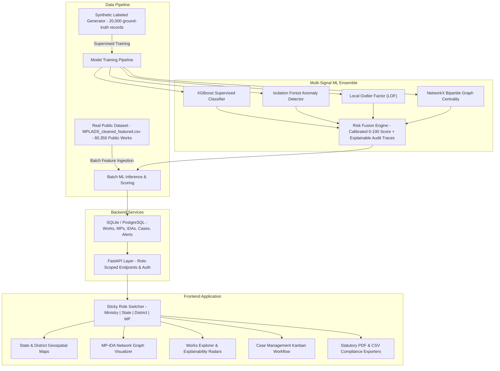

# SETU — AI-Powered MPLADS Anomaly, Fraud & Inefficiency Detection Platform (SIH26102)

[](https://fastapi.tiangolo.com)
[](https://nextjs.org)
[](https://www.python.org)
[](https://xgboost.readthedocs.io)
[](https://scikit-learn.org)

**SETU** (Smart Expenditure Tracking & Understanding) is a full-stack, explainable AI platform designed to detect cost escalation, duplicate allocations, vendor capture, contract structuring, and ghost projects across India's **Member of Parliament Local Area Development Scheme (MPLADS)** under the Ministry of Statistics and Programme Implementation (MoSPI).

---

## 🏛️ System Architecture



---

## 🚀 Quickstart & Setup Guide

### Prerequisites
- **Python 3.10+**
- **Node.js 18+** and **npm**
- **Git**

---

### 1. Clone & Navigate to Repository
```bash
git clone <repo-url>
cd "sih 2026"
```

---

### 2. Backend Setup (FastAPI & ML Engine)

1. **Create and Activate Python Virtual Environment**:
   ```bash
   # On Windows (PowerShell):
   python -m venv backend/venv
   .\backend\venv\Scripts\Activate.ps1

   # On Linux/macOS:
   python3 -m venv backend/venv
   source backend/venv/bin/activate
   ```

2. **Install Backend Dependencies**:
   ```bash
   pip install -r backend/requirements.txt
   ```

3. **Train ML Models on Synthetic Labeled Data**:
   ```bash
   # Generates 20,000 labeled records, fits XGBoost + Isolation Forest + Graph, saves models
   python backend/app/ml/training/train_all.py
   ```

4. **Ingest & Score Real Dataset into Database**:
   ```bash
   # Ingests MPLADS_cleaned_featured.csv, scores all works, and seeds initial MPs/IDAs/Cases
   python backend/app/ml/data/real_data_loader.py
   ```

5. **Run Backend Test Suite**:
   ```bash
   cd backend
   pytest app/tests/
   cd ..
   ```

6. **Start FastAPI Backend Server**:
   ```bash
   cd backend
   uvicorn app.main:app --host 127.0.0.1 --port 8000 --reload
   ```
   - **Backend API**: `http://127.0.0.1:8000`
   - **Interactive API Documentation (Swagger)**: `http://127.0.0.1:8000/docs`

---

### 3. Frontend Setup (Next.js 14 + Tailwind CSS)

1. **Open a new terminal and navigate to `frontend`**:
   ```bash
   cd frontend
   ```

2. **Install NPM Packages**:
   ```bash
   npm install --legacy-peer-deps
   ```

3. **Start Next.js Dev Server**:
   ```bash
   npm run dev -- -p 3000
   ```
   - **Frontend Dashboard**: `http://localhost:3000`

---

## 🎯 Key Personas Supported by Role Switcher

The platform features a sticky **Role Switcher** at the top of the screen that dynamically re-scopes the entire database, maps, charts, and alert triage:

| Role | Persona | Jurisdiction | Scope & Focus |
| :--- | :--- | :--- | :--- |
| **Ministry** | Central Directorate (MoSPI) | National | State risk choropleth, inter-state disparity, macro fraud typologies |
| **State** | State Nodal Authority | Bihar / Rajasthan | District drill-down, IDA monopolies, cross-constituency audits |
| **District** | District Magistrate (DM) | DARBHANGA / DHOLPUR | Village GPS pins, contractor tenders, high-risk work approval triage |
| **MP** | Member of Parliament | Mr Gopal Jee Thakur | Recommended work progress, stall prevention, transparency score |

---

## 🔬 Multi-Signal ML Ensemble Architecture

Every public work recommendation is evaluated across 6 distinct signal vectors:

1. **Peer-Relative Cost Z-Score**:
   $$\text{Z}_{\text{State}} = \frac{\text{Amount} - \mu_{\text{State, WorkType}}}{\sigma_{\text{State, WorkType}}}$$
   Detects overpricing relative to identical civil works in the same state.

2. **Duplicate & Cluster Density**:
   Exact and TF-IDF fuzzy cosine similarity grouping to catch duplicate recommendations across adjacent villages by the same MP.

3. **Statutory Structuring / Smurfing**:
   Proximity detector identifying contracts clustered immediately below key statutory sanction thresholds (e.g., ₹4,99,000 vs ₹5,00,000 tender ceiling).

4. **Vendor / Implementing Agency Capture**:
   Calculates MP-to-IDA monopolization ratios and flags when $>65\%$ of an MP's funds are channeled to a single executing agency.

5. **Execution Stall & Ghost Project Proxy**:
   Tracks elapsed days since recommendation vs administrative approval status ($>180$ days in unsanctioned status indicates ghost risk).

6. **Supervised XGBoost Classifier**:
   Trained on 20,000 ground-truth labeled synthetic cases across 5 fraud typologies with feature importance ranking.

---

## 📊 Model Evaluation Benchmarks

| Metric | Holdout Evaluation Score |
| :--- | :--- |
| **ROC-AUC** | **0.980** |
| **Precision** | **77.4%** |
| **Recall / Sensitivity** | **79.1%** |
| **Overall Accuracy** | **93.4%** |
| **Training Sample** | 20,000 labeled records (80/20 train/test stratified split) |
| **Inference Dataset** | 60,356 real public MPLADS records (`MPLADS_cleaned_featured.csv`) |

---

## 📁 Repository Structure

```
sih 2026/
├── MPLADS_cleaned_featured.csv      # Real public MPLADS dataset (60,356 works)
├── README.md                         # Setup & Architecture guide
├── APP_DEEP_DIVE_EXPLAINER.md        # Complete line-by-line concept explainer
│
├── backend/
│   ├── setu_mplads.db                # SQLite database (with PostgreSQL support)
│   ├── requirements.txt              # Python dependencies
│   ├── app/
│   │   ├── main.py                   # FastAPI app entrypoint
│   │   ├── core/                     # Config, security (JWT), database session
│   │   ├── models/                   # SQLAlchemy models (Work, MP, IDA, Case, Alert)
│   │   ├── schemas/                  # Pydantic v2 validation schemas
│   │   ├── api/routers/              # API routers (dashboard, works, geo, graph, cases, reports)
│   │   ├── services/                 # Business logic & query aggregation
│   │   ├── ml/
│   │   │   ├── data/                 # Synthetic generator & real CSV loader
│   │   │   ├── features/             # Feature extraction (z-score, duplicate, vendor, structuring)
│   │   │   ├── models/               # XGBoost, Isolation Forest, LOF, Graph Centrality
│   │   │   ├── inference/            # Batch inference & explainability engine
│   │   │   ├── training/             # train_all.py & evaluate_models.py
│   │   │   └── saved_models/         # Persisted .joblib model artifacts & metrics.json
│   │   └── tests/                    # Pytest test suite (13/13 passing)
│
└── frontend/
    ├── package.json                  # Node.js dependencies
    ├── tailwind.config.js            # Design tokens & color palette
    ├── context/RoleContext.tsx        # Persistent Role Switcher state
    ├── lib/                          # API client & TypeScript interfaces
    ├── components/
    │   ├── Navbar.tsx                # Government header & emblem
    │   ├── Sidebar.tsx               # Navigation menu
    │   ├── RoleSwitcher.tsx          # Sticky persona toggle banner
    │   ├── maps/                     # State Choropleth, District, & Constituency Maps
    │   ├── graph/                    # Force-directed MP-IDA Network Canvas
    │   └── ui/                       # StatCard, RiskBadge, ComingSoonModal
    └── app/
        ├── layout.tsx                # Root layout
        ├── page.tsx                  # Dynamic role-scoped dashboard
        ├── works/                    # Works Explorer & Detail page with Radar chart
        ├── maps/                     # Geospatial multi-tier visualizer
        ├── graph/                    # Dedicated MP-IDA relationship graph
        ├── cases/                    # Kanban case management workflow
        ├── alerts/                   # Real-time anomaly alerts feed
        ├── reports/                  # PDF audit dossiers & CSV exporter
        ├── model-metrics/            # ML model evaluation & fairness panel
        └── roadmap/                  # Future architecture specifications
```

---

## 📄 License & Attribution
Developed for the **Smart India Hackathon 2026 (SIH26102)** under the Ministry of Statistics and Programme Implementation (MoSPI) problem statement.
