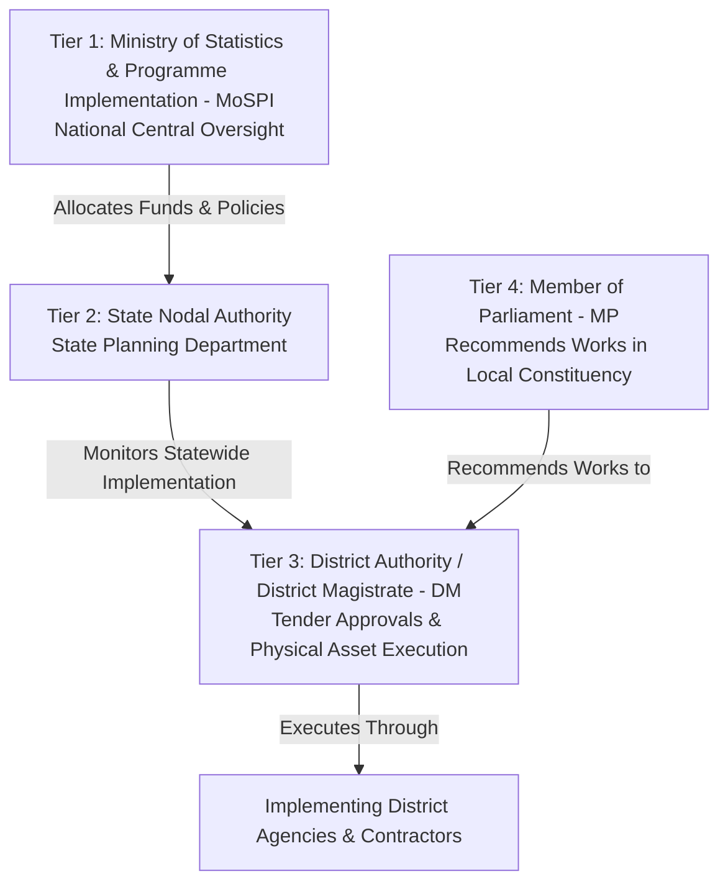

# SETU: Complete Role Clarity & Governance Hierarchy Guide

> **This document explains who each user is, what real-world problems they face, and exactly what SETU provides to each role.**

---

## 🏛️ The 4-Tier Indian Governance Hierarchy

In India's parliamentary democracy, the **MPLADS fund** (₹5 Crore per year per MP) flows through four distinct administrative tiers:

---

## 1. Role 1: Ministry (MoSPI — National Oversight)

### Who They Are
The **Ministry of Statistics and Programme Implementation (MoSPI)** is the central government ministry in New Delhi responsible for managing the national MPLADS budget (~₹4,000 Crore annually across 790+ MPs).

### Their Real-World Pain Point
- They sit in New Delhi and **cannot manually inspect 60,000+ public works** across 28 States and 8 UTs.
- They need macro-level visibility: *Which states have high fraud rates? Which fraud typologies (overpricing vs ghost projects) dominate nationally? Where are funds being wasted?*

### What SETU Provides to the Ministry
1. **National State Risk Choropleth Map**:
   - An interactive map of India coloring every state from **Emerald (Clean)** to **Amber (Medium)** to **Red (Critical)** based on average risk scores.
   - Instantly reveals high-risk states (e.g., Bihar, Rajasthan, Uttar Pradesh) with expenditure at risk.
2. **National Macro KPI Stat Cards**:
   - Total works nationwide (60,356 works)
   - Total fund outlay (₹1,000+ Crore)
   - Total high-risk flagged works and amount at risk
3. **National Fraud Typology Breakdown**:
   - Bar distributions showing what percentage of national fraud is *Cost Escalation* vs *Duplicate Clusters* vs *Vendor Capture* vs *Structuring* vs *Stalled Works*.
4. **Parliamentary Audit Dossier (PDF)**:
   - One-click generation of the certified **Public Accounts Committee (PAC) Audit Dossier** for national parliamentary reporting.

---

## 2. Role 2: State Nodal Authority (State Level — e.g., Govt of Bihar)

### Who They Are
The **State Planning & Rural Development Department** (headed by the State Nodal Officer) responsible for overseeing all parliamentary constituencies and districts within that specific state.

### Their Real-World Pain Point
- Certain districts within the state quietly capture disproportionate funds, while other backward districts get starved.
- State-level contractor syndicates monopoly-capture multiple neighboring districts without the state nodal officer noticing.

### What SETU Provides to the State Nodal Authority
1. **District Risk Drill-Down Map**:
   - Automatically scopes the map to their specific state (e.g. *Bihar* or *Rajasthan*).
   - Ranks all districts (e.g., *Darbhanga, Patna, Gaya, Muzaffarpur*) by average risk score and amount at risk.
2. **Cross-District Vendor Monopoly Alerts**:
   - Surfaces Implementing Agencies (IDAs) that capture $>65\%$ of all works across adjacent constituencies.
3. **State-Level High-Risk Works Leaderboard**:
   - Displays the top flagged projects in that state requiring immediate state inspection notices.
4. **State Compliance Export**:
   - Filterable CSV dataset and state-specific audit briefs for state cabinet vigilance meetings.

---

## 3. Role 3: District Authority / DM (District Level — e.g., District Magistrate, Darbhanga)

### Who They Are
The **District Magistrate (DM) / Deputy Commissioner / District Collector**. They are the **statutory sanctioning authority** who approves work estimates, issues technical sanctions, and releases money to contractors and implementing agencies.

### Their Real-World Pain Point
- When an MP sends a list of 50 work recommendations, the DM's office has only junior engineers who might not notice duplicate requests, overpriced estimates, or contracts deliberately split to bypass ₹5 Lakh tender limits.
- If the DM signs an overpriced or duplicate sanction, **they are legally accountable for corruption**.

### What SETU Provides to the District Magistrate
1. **Pre-Sanction Approval & Triage Queue**:
   - Instantly highlights high-risk proposals in the DM's district *before* administrative sanction is granted.
2. **Statutory Structuring / Smurfing Alarms**:
   - Flags works recommended at ₹4,87,000 or ₹4,99,000 specifically calculated to avoid the ₹5 Lakh statutory e-tendering threshold.
3. **Local Village & Ward GPS Marker Pins**:
   - Zoomed-in map of the district showing exact village-level markers (e.g., *Jagdishpur, Chandaur, Kotma*) colored by anomaly risk.
4. **Case Management Kanban Board**:
   - 3-column triage board (*Flagged $\to$ Under Field Inquiry $\to$ Resolved*) where the DM can assign vigilance officers, log ground-truth inspection notes, and clear verified projects.

---

## 4. Role 4: Member of Parliament (MP — e.g., Mr Gopal Jee Thakur)

### Who They Are
The **elected representative** (Lok Sabha or Rajya Sabha MP) who recommends public works for their constituents.

### Their Real-World Pain Point
- MPs often get blamed by the public for unfinished works, even when the delay was caused by a slow district agency (IDA).
- MPs want to ensure their ₹5 Crore annual budget is spent transparently, projects don't get stalled for 300+ days, and their political transparency reputation remains clean.

### What SETU Provides to the MP
1. **Constituency Fund Utilization Tracker**:
   - Tracks total funds recommended vs total approved vs ongoing vs completed.
2. **Stall Duration & Ghost Project Prevention Alerts**:
   - Proactively alerts the MP if a recommended road or drinking water plant has been sitting idle in *"Action Pending"* for $>180$ days, allowing the MP to hold the District Collector accountable.
3. **Constituency Transparency & Compliance Score**:
   - Gives the MP an objective score (e.g., 94.2% Compliance) to showcase clean governance to their voters.
4. **Local Constituency Heatmap**:
   - Shows where in their constituency works are concentrated, helping ensure fair distribution across all villages and panchayats.

---

## 📊 Summary Comparison Matrix

| Feature / Capability | 🏛️ Ministry (MoSPI) | 🏢 State Nodal | 📍 District (DM) | 👤 Member of Parliament (MP) |
| :--- | :--- | :--- | :--- | :--- |
| **Jurisdiction Scope** | National (All India) | Single State (e.g. Bihar) | Single District (e.g. Darbhanga) | Single MP / Constituency |
| **Primary Map View** | National State Risk Choropleth | District Risk Drill-down | Village/Ward GPS Pin Map | Constituency Project Pins |
| **Primary Goal** | Macro policy, national PAC audit | Inter-district equity, state oversight | Pre-sanction fraud check, contractor audit | Fund utilization, stall prevention |
| **Fraud Typologies Focus** | Inter-state cost variance & macro leakage | Multi-district vendor capture | Structuring (<₹5L) & duplicate tenders | Stagnant/stalled projects (>180 days) |
| **Key Action on Platform** | Download National PAC Dossier (PDF) | Issue state vigilance audit directives | Move cases in Kanban, log field notes | Track project progress & hold IDA accountable |
| **Top Metric** | Total National Expenditure & Anomaly % | State Risk Index & Flagged Count | Pending Sanctions Triage & Risk Amount | Utilization Rate & Transparency Score |

---

## 🔄 Real-World Walkthrough Scenario

To understand how the platform works end-to-end, let's trace a real flagged work in the system:

### 🚨 The Example: Work `W-10002` (Street Lights in Darbhanga)
- **What happened**: 22 identical street light works were recommended for ₹4,87,000 each in adjacent villages, all routed to the same agency (`DISTRICT MAGISTRATE DARBHANGA_IDA`), sitting in pending status for months.

### How Each Role Experiences This Record:

1. **The Ministry (MoSPI)**:
   - Sees Bihar highlighted in **Red/Critical** on the National Map.
   - Sees that *"Duplicate & Clustered Works"* is the #1 fraud typology in Bihar.
   - Exports the national PAC PDF report noting Bihar's ₹24.5 Lakhs at risk.

2. **The State Nodal Authority (Bihar)**:
   - Drills down to Bihar on the map and sees **Darbhanga** ranked as the #1 highest-risk district.
   - Sees that one agency in Darbhanga is capturing 74% of the MP's works.
   - Issues a formal inquiry notice to the Darbhanga Collectorate.

3. **The District Magistrate (Darbhanga)**:
   - Opens the dashboard and sees Work `W-10002` flagged in **Critical Risk (82.0/100)** in the approval queue.
   - Clicks **Explain Trace** to view the Radar Chart showing high duplicate density and structuring risk.
   - Clicks **Flag for Investigation**, moving it into the **Case Management Kanban**.
   - Sends a field engineer who logs an audit note: *"Inspected site. Found estimate exceeded CPWD rate by 40%. Revised contract amount to ₹2,90,000."*
   - Clicks **Mark Resolved**.

4. **The Member of Parliament (Mr Gopal Jee Thakur)**:
   - Sees the project status update from *"Stalled"* to *"Resolved & Executing"*.
   - Confirms that public funds were protected and street lights are now being physically installed in Jagdishpur village.
